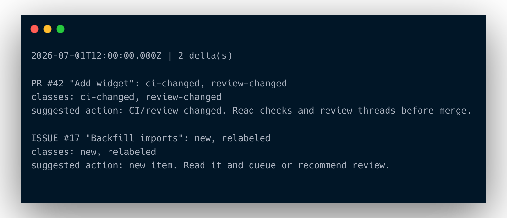
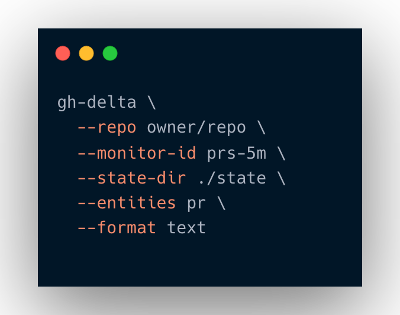
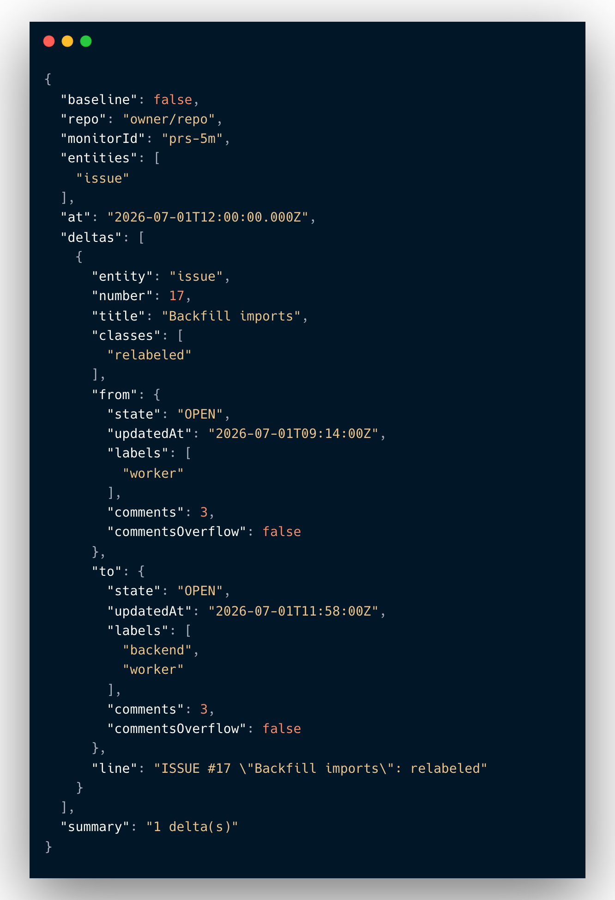

# gh-delta <!-- omit in toc -->

[](https://www.npmjs.com/package/gh-delta)
[](https://github.com/diegomarino/gh-delta/actions/workflows/ci.yml)
[](https://nodejs.org)
[](LICENSE)

`gh-delta` is a small deterministic GitHub watcher for agent or automation loops.
It runs one detection pass, compares current GitHub issue and pull request state
with a local snapshot, prints JSON or operator text, and exits with a
machine-readable code. Scheduling belongs to cron, an automation system, or the
caller.

The tool does not decide what to do. It only detects changes such as new PRs,
merged PRs, CI status changes, review decision changes, unresolved review
threads, new comments, relabeling, missing objects, and catch-all updates. Your
orchestrator, script, or agent owns the action.

<p align="center">
  
</p>

## Table of Contents <!-- omit in toc -->

- [Requirements](#requirements)
- [Quick Start](#quick-start)
- [CLI](#cli)
- [Snapshot Identity](#snapshot-identity)
- [Outpost Delivery](#outpost-delivery)
- [Report Shape](#report-shape)
- [Delta Classes](#delta-classes)
- [Watch Loop Use](#watch-loop-use)
- [Programmatic Use](#programmatic-use)
- [Output Samples](#output-samples)
  - [`--format text`](#--format-text)
  - [`--format json`](#--format-json)
  - [`--help-json`](#--help-json)
- [Design Notes](#design-notes)
- [Troubleshooting / FAQ](#troubleshooting--faq)
- [Development](#development)
- [Documentation](#documentation)
- [License](#license)

## Requirements

- Node.js 18 or newer.
- GitHub CLI (`gh`) installed and authenticated.
- Read access to the repository being watched.

## Quick Start

<p align="center">
  
</p>

Install from npm once published:

```bash
npm install --global gh-delta
gh-delta --help
gh-delta --help-json
gh-delta --version
```

No install required — run directly with npx:

```bash
npx gh-delta \
  --repo owner/repo \
  --monitor-id prs \
  --state-dir ./state \
  --entities pr \
  --format json
```

Or run from a source checkout:

```bash
git clone https://github.com/diegomarino/gh-delta.git
cd gh-delta
npm install
npm run check

node ./gh-delta.mjs \
  --repo owner/repo \
  --monitor-id prs \
  --state-dir ./state \
  --entities pr \
  --format json
```

The first successful run establishes the baseline and exits `0`. Later runs
compare against that baseline.

For scheduled watcher ticks, use text output:

```bash
gh-delta \
  --repo owner/repo \
  --monitor-id prs-5m \
  --state-dir ./state \
  --entities pr \
  --format text
```

To notify an external endpoint when deltas appear, add an HTTP(S) outpost:

```bash
gh-delta \
  --repo owner/repo \
  --monitor-id prs-5m \
  --state-dir ./state \
  --entities pr \
  --format text \
  --outpost-url https://example.com/gh-delta
```

## CLI

```bash
gh-delta --repo <owner/name> --monitor-id <id> (--state-dir <dir> | --state-file <path>) [--entities pr,issue] [--format json|text] [--detail] [--outpost-url <url>]
```

Options:

- `--repo`: repository in `owner/name` form. Required.
- `--monitor-id`: stable monitor identity used in reports, event IDs, and
  derived snapshot paths. Required.
- `--state-dir`: directory for a derived snapshot path scoped by repo, monitor
  id, and selected entities. Mutually exclusive with `--state-file`.
- `--state-file`: explicit snapshot JSON path. Mutually exclusive with
  `--state-dir`.
- `--entities`: `pr`, `issue`, or `pr,issue`. Defaults to `pr,issue`. When a
  partial entity set is used, the unrequested side of the snapshot is preserved.
- `--format`: `json` or `text`. Defaults to `json`.
- `--detail`: add a human-readable `line` field to each delta in JSON output.
  Text output adds detail automatically.
- `--outpost-url`: HTTP(S) endpoint that receives one JSON `POST` per delta when
  the detector exits `10`.
- `--help`: print usage.
- `--help-json`: print versioned, machine-readable help for LLMs, agents, and
  other tooling. The top-level `helpSchemaVersion` field starts at `1`.
- `--version`: print the package version from `package.json`.

`gh-delta` never creates schedules, timers, automations, or wake-ups.

Exit codes: see [Exit Codes](docs/contract.md#exit-codes).

## Snapshot Identity

With `--state-dir`, the snapshot path is derived from:

```text
repo + monitor-id + entities
```

Example:

```bash
gh-delta --repo org/app --monitor-id prs-5m --state-dir ./state --entities pr
```

uses:

```text
./state/org-app__prs-5m__pr.json
```

Use different `--monitor-id` values for monitors that should keep independent
state. Reusing the same monitor id and entity set points multiple invocations at
the same snapshot.

## Outpost Delivery

`--outpost-url` is optional. Without it, behavior is unchanged. With it,
`gh-delta` validates the URL before fetching GitHub state, then sends one HTTP
`POST` per delta only when the detector exits `10`.

Outpost delivery is fire-and-forget and at-most-once:

- no retries;
- no batching;
- no outbox, JSONL queue, SQLite store, or acknowledgement layer;
- outpost failure, timeout, DNS failure, `4xx`, or `5xx` does not change the
  detector exit code;
- the snapshot has already advanced before outpost delivery is attempted.

The external endpoint is responsible for filtering events, deduplicating by
`eventId`, and executing any downstream action. Outpost logs intentionally avoid
printing endpoint URLs, query strings, headers, or future auth material.

See [Outpost payload schema v1](docs/contract.md#outpost-payload-schema-v1) for the full envelope and `eventId` semantics.

## Report Shape

See [Report Shape](docs/contract.md#report-shape) for the full JSON structure.

## Delta Classes

See [Delta Classes](docs/contract.md#delta-classes) for the full list.

## Watch Loop Use

See [RUNBOOK.md](RUNBOOK.md) for timer-driven loop patterns. The recommended
setup is cron-native: seed the baseline once, then create a recurring scheduler
whose prompt runs one detector pass with `--format text` and stops. Do not call
`ScheduleWakeup` or create another cron from inside a cron-owned tick.

See [docs/watch-loop-prompt.md](docs/watch-loop-prompt.md) for a prompt template
for cron-owned watcher ticks.

Delivery note: successful detections advance the snapshot before any agent
action or outpost finishes. Keep scheduler logs for text output, or add an
external queue if you need at-least-once action delivery.

## Programmatic Use

`gh-delta` also exposes a small ESM surface for embedding in orchestrators:

```js
import { detectDeltas } from 'gh-delta/detect';
import {
  canonicalizeCiRollup,
  hashReviews,
  issueFingerprint,
  prFingerprint,
} from 'gh-delta/fingerprint';
import {
  buildOutpostPayload,
  postOutpost,
  sendOutposts,
  validateOutpostUrl,
} from 'gh-delta/outpost';
import { readSnapshot, snapshotPath, writeSnapshotAtomic } from 'gh-delta/snapshot';
import { parseEntitySelection, parseOutpostArgs } from 'gh-delta/args';
import { getPackageMetadata, renderVersionText } from 'gh-delta/version';
```

| Import                 | Exported names                                                             | Purpose                            |
| ---------------------- | -------------------------------------------------------------------------- | ---------------------------------- |
| `gh-delta/detect`      | `detectDeltas`                                                             | Pure delta classification          |
| `gh-delta/fingerprint` | `canonicalizeCiRollup`, `hashReviews`, `issueFingerprint`, `prFingerprint` | GitHub object fingerprint helpers  |
| `gh-delta/outpost`     | `buildOutpostPayload`, `postOutpost`, `sendOutposts`, `validateOutpostUrl` | Outpost payload + delivery helpers |
| `gh-delta/snapshot`    | `readSnapshot`, `snapshotPath`, `writeSnapshotAtomic`                      | Snapshot path/read/write helpers   |
| `gh-delta/args`        | `parseEntitySelection`, `parseOutpostArgs`                                 | Shared argument parsing helpers    |
| `gh-delta/version`     | `getPackageMetadata`, `renderVersionText`                                  | Package metadata + version text    |

All subpaths are pure ESM (`"type": "module"`). The package has no runtime dependencies.

One confirmed call shape: `buildOutpostPayload({ report, delta })`.

## Output Samples

### `--format text`

Text output consists of an ISO timestamp heartbeat line followed by one block
per delta. Each block has the entity label, the delta classes, and a suggested
action derived from those classes:

```text
2026-07-01T12:00:00.000Z | 2 delta(s)

PR #42 "Add widget": ci-changed, review-changed
classes: ci-changed, review-changed
suggested action: CI/review changed. Read checks and review threads before merge.

ISSUE #17 "Backfill imports": new, relabeled
classes: new, relabeled
suggested action: new item. Read it and queue or recommend review.
```

When no deltas are found the output is:

```text
2026-07-01T12:00:00.000Z | 0 delta(s)

No GitHub deltas since the last snapshot.
```

On error (exit `1`):

```text
2026-07-01T12:00:00.000Z | error | 0 delta(s)

gh-delta error: <error message>
Snapshot was not updated. No action taken. The next scheduled tick should retry.
```

### `--format json`

The same detection tick, machine-readable. Each delta carries its previous and
current fingerprints as `from`/`to`; see
[Report Shape](docs/contract.md#report-shape) for the full envelope.

<p align="center">
  
</p>

### `--help-json`

`gh-delta --help-json` prints a versioned machine-readable help document to
stdout. The top-level `helpSchemaVersion` field is `1`. The full document
includes all options, exit codes, output metadata, safety guarantees, and
examples. Excerpt:

```json
{
  "helpSchemaVersion": 1,
  "command": "gh-delta",
  "version": "0.1.0",
  "summary": "Deterministic GitHub issue and pull request delta detector.",
  "usage": "gh-delta --repo <owner/name> --monitor-id <id> (--state-dir <dir> | --state-file <path>) [--entities pr,issue] [--format json|text] [--outpost-url <url>]",
  "purpose": "Run one deterministic detection pass, update the snapshot after a successful fetch, print JSON or operator text, and exit. Scheduling belongs to the caller.",
  "options": [
    {
      "name": "--repo",
      "valueName": "owner/name",
      "type": "string",
      "required": true,
      "description": "GitHub repository in owner/name form."
    },
    {
      "name": "--monitor-id",
      "valueName": "id",
      "type": "string",
      "required": true,
      "description": "Stable monitor identity used in reports, event IDs, and derived snapshot paths."
    }
  ]
}
```

Run `gh-delta --help-json` to emit the complete document.

## Design Notes

`gh-delta` is split into pure logic and impure edges:

- `lib/args.mjs`: shared CLI argument helpers for entity selection and outposts.
- `lib/fingerprint.mjs`: stable fingerprints for PRs and issues.
- `lib/detect.mjs`: compares snapshots and classifies deltas.
- `lib/gh.mjs`: calls `gh pr list`, `gh issue list`, and `gh api graphql` for
  PR review thread counts.
- `lib/snapshot.mjs`: reads and atomically writes snapshot files.
- `lib/outpost.mjs`: validates outpost URLs, builds schema v1 payloads, and
  sends short-timeout HTTP POSTs.
- `lib/text-output.mjs`: formats operator text and outpost warnings.
- `lib/version.mjs`: reads package metadata for `--version` and help JSON.
- `lib/help.mjs`: shared human and machine-readable CLI help metadata.
- `lib/entrypoint.mjs`: symlink-safe bin entrypoint detection for npm/npx.
- `gh-delta.mjs`: CLI wiring, output formats, outposts, and exit codes.

More detail is in [docs/architecture.md](docs/architecture.md).

Current v0.1 scope: the GitHub CLI fetch fails closed if either PR or issue
results hit the hard `500` item limit, or if an open PR has more than 100 review
threads and nested review-thread pagination would be required. Use a narrower
monitor scope or wait for a broader paginated fetcher for larger repositories.

Research for future entity types and selectors lives under
[docs/entities-research](docs/entities-research/README.md). Those notes are not
public CLI contract.

## Troubleshooting / FAQ

**`gh` is not authenticated — exit `1` on first run.**
Run `gh auth status` to verify authentication. `gh-delta` delegates all GitHub
fetches to the `gh` CLI. If `gh` is not authenticated or lacks read access to
the repository, the detector exits `1` and does not touch the snapshot. Fix
authentication first, then retry.

**"GitHub returned 500 PRs/issues" / incomplete review-thread pages.**
The tool fails closed (exit `1`) rather than silently truncating results when
either the PR or issue list hits the hard 500-item limit, or when an open PR
has more than 100 review threads and nested pagination would be required. Narrow
the monitor scope (use a tighter `--entities` selection, watch a fork, or split
into multiple monitors) before continuing.

**The same delta refires every tick.**
If `gh-delta` repeatedly reports the same delta on every scheduled run, stop
and investigate the underlying GitHub state before taking any action. Do not
act repeatedly on the same delta — this is a signal that something unexpected
is happening on the GitHub side or in your monitor configuration.

**Corrupt snapshot / invalid JSON — exit `1`, snapshot not updated.**
If the snapshot file is invalid JSON or unreadable, `gh-delta` exits `1` and
leaves the file untouched to preserve monitor memory. Do not hand-edit snapshot
files. If recovery is needed, delete the snapshot and re-seed the baseline with
a fresh first run.

## Development

```bash
npm test
npm run test:coverage
npm run lint
npm run format:check
npm run check
npm run release:check
```

`npm run check` is the normal local gate: ESLint, Prettier check, then the Node
test suite. `npm run release:check` adds the coverage report and `npm pack
--dry-run` package-content verification.

`npm run e2e:playground` runs a live acceptance test that creates and deletes a
real private GitHub repository via `gh`. It requires an authenticated `gh` and
network access; do not run it in CI or sandboxes. See
[test/e2e/README.md](test/e2e/README.md).

The project intentionally has no runtime dependencies. Development tooling is
limited to ESLint and Prettier.

See [docs/release-checklist.md](docs/release-checklist.md) before publishing a
new npm release.

## Documentation

| Doc                                                                  | Read it when                                               |
| -------------------------------------------------------------------- | ---------------------------------------------------------- |
| [RUNBOOK.md](RUNBOOK.md)                                             | Setting up a scheduled watch loop                          |
| [docs/contract.md](docs/contract.md)                                 | You need the exact classes, exit codes, and payload schema |
| [docs/architecture.md](docs/architecture.md)                         | Understanding internals and boundaries                     |
| [docs/watch-loop-prompt.md](docs/watch-loop-prompt.md)               | You want a cron-tick prompt template                       |
| [docs/entities-research/README.md](docs/entities-research/README.md) | Researching future watch entities                          |
| [CONTRIBUTING.md](CONTRIBUTING.md)                                   | Contributing changes                                       |
| [CHANGELOG.md](CHANGELOG.md)                                         | Checking what changed between versions                     |

## License

[MIT](LICENSE) © diegomarino
