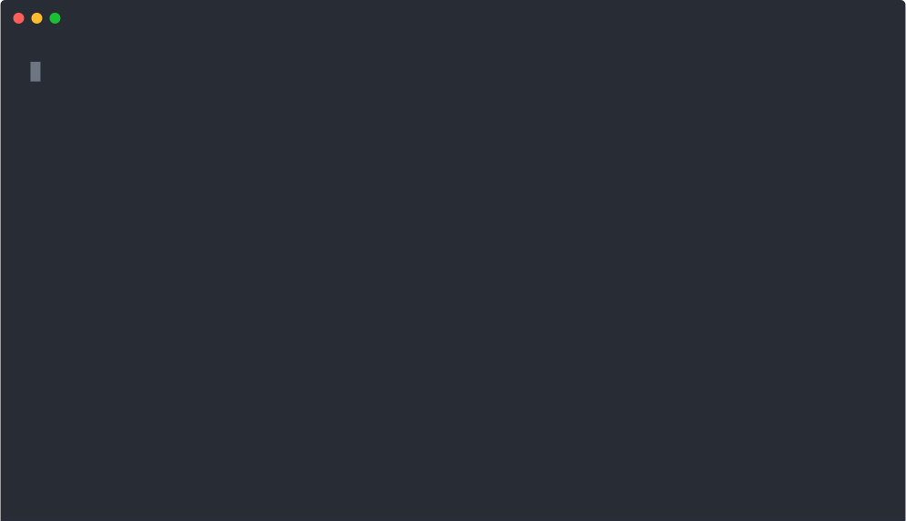
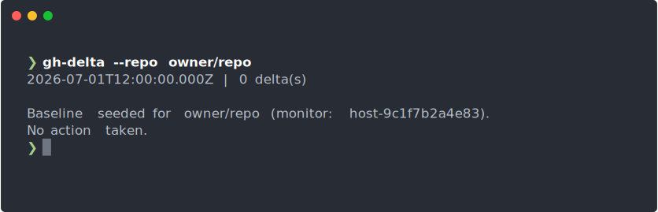
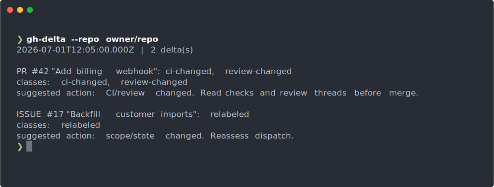
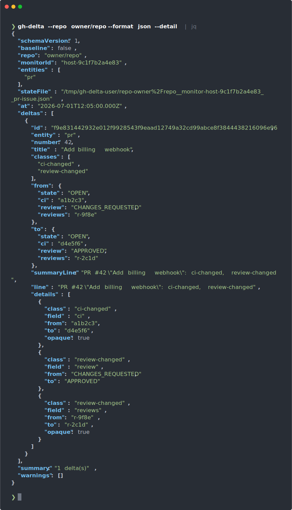

# gh-delta <!-- omit in toc -->

[](https://www.npmjs.com/package/gh-delta)
[](https://github.com/diegomarino/gh-delta/actions/workflows/ci.yml)
[](https://nodejs.org)
[](LICENSE)

`gh-delta` is a small deterministic GitHub watcher for agent or automation loops.
It runs one detection pass, compares current GitHub issue and pull request state
with a local snapshot, prints JSON or operator text, and exits with a
machine-readable code. Scheduling belongs to cron, an automation system, or the
caller.

The tool does not decide what to do. It only detects changes such as new PRs,
merged PRs, CI status changes, review decision changes, unresolved review
threads, new comments, relabeling, missing objects, and catch-all updates. Your
orchestrator, script, or agent owns the action.

`gh-delta` is not a dashboard, inbox, or PR bot. It is a deterministic GitHub
delta detector for schedulers, scripts, and agent loops.

See [Alternatives and adjacent tools](docs/alternatives.md) for how `gh-delta`
compares to related projects.

<p align="center">
  
</p>

## Table of Contents <!-- omit in toc -->

- [Requirements](#requirements)
- [Quick Start](#quick-start)
- [CLI](#cli)
- [Snapshot Identity](#snapshot-identity)
- [Outpost Delivery](#outpost-delivery)
- [Report Shape](#report-shape)
- [Delta Classes](#delta-classes)
- [Watch Loop Use](#watch-loop-use)
- [Programmatic Use](#programmatic-use)
- [Output Samples](#output-samples)
  - [`--format text`](#--format-text)
  - [`--format json`](#--format-json)
  - [`--help-json`](#--help-json)
- [Design Notes](#design-notes)
- [Troubleshooting](#troubleshooting)
- [Development](#development)
- [Documentation](#documentation)
- [License](#license)

## Requirements

- Node.js 18 or newer.
- GitHub CLI (`gh`) installed and authenticated.
- Read access to the repository being watched.

To validate `gh` auth locally:

```bash
gh auth status
```

## Quick Start

<p align="center">
  
</p>

Minimal zero-config invocation — state and monitor identity are derived automatically (see [Snapshot Identity](#snapshot-identity)):

```bash
gh-delta --repo owner/repo
```

Install from npm once published:

```bash
npm install --global gh-delta
gh-delta --help
gh-delta --help-json
gh-delta --version
```

No install required — run directly with npx:

```bash
npx gh-delta \
  --repo owner/repo \
  --monitor-id prs \
  --state-dir ./state \
  --entities pr \
  --format json
```

Or run from a source checkout:

```bash
git clone https://github.com/diegomarino/gh-delta.git
cd gh-delta
npm install
npm run check

node ./gh-delta.mjs \
  --repo owner/repo \
  --monitor-id prs \
  --state-dir ./state \
  --entities pr \
  --format json
```

`gh-delta` is intentionally thin and dependency-free at runtime. A minimal
production run for one monitor typically looks like:

```bash
gh-delta --help-json >/tmp/gh-delta-help.json && jq . < /tmp/gh-delta-help.json
gh-delta --repo owner/repo --monitor-id prs-5m --state-dir ./state --entities pr --format text
```

The first successful run establishes the baseline and exits `0`. Later runs
compare against that baseline.

For scheduled watcher ticks, use text output:

```bash
gh-delta \
  --repo owner/repo \
  --monitor-id prs-5m \
  --state-dir ./state \
  --entities pr \
  --format text
```

To notify an external endpoint when deltas appear, add an HTTP(S) outpost:

```bash
gh-delta \
  --repo owner/repo \
  --monitor-id prs-5m \
  --state-dir ./state \
  --entities pr \
  --format text \
  --outpost-url https://example.com/gh-delta
```

## CLI

```bash
gh-delta --repo <owner/name> [--monitor-id <id>] [--state-file <path> | --state-dir <dir>] [--entities pr,issue] [--format json|text] [--summary-line] [--detail] [--outpost-url <url>] [--outpost-timeout-ms <ms>] [--outpost-max-posts <n>] [--gh-timeout-ms <ms>]
```

Options:

- `--repo`: repository in `owner/name` form. Required. **Canonicalized to
  lowercase** — snapshot paths, report echoes, and outpost event IDs always use
  the lowercased form.
- `--monitor-id`: stable monitor identity used in reports, event IDs, and
  derived snapshot paths. Must start with a letter or number and contain only
  letters, numbers, dot, underscore, or dash. **Optional**: defaults to
  `host-` + the first 12 hex characters of the sha1 of the machine hostname —
  stable per machine. A renamed host, container, or CI runner with a per-job
  hostname gets a new id and a fresh baseline; pass `--monitor-id` explicitly
  in CI.
- `--state-dir`: directory for a derived snapshot path scoped by repo, monitor
  id, and selected entities. Optional; mutually exclusive with `--state-file`.
  When neither flag is given, a per-user temp directory under the system temp
  dir is used automatically (ephemeral — reboots or tmp cleanup silently
  re-seed the baseline). Pass `--state-dir` explicitly for durable monitors.
- `--state-file`: explicit snapshot JSON path. Optional; mutually exclusive with
  `--state-dir`.
- `--entities`: `pr`, `issue`, or `pr,issue`. Defaults to `pr,issue`. When a
  partial entity set is used, the unrequested side of the snapshot is preserved.
- `--format`: `json` or `text`. Defaults to `json`.
- `--summary-line`: add a human-readable `summaryLine` field to each JSON delta.
- `--detail`: add structured `details` per JSON delta, plus `summaryLine` and the
  backward-compatible `line` alias. Text output adds the human line automatically.
- `--outpost-url`: HTTP(S) endpoint that receives one JSON `POST` per delta when
  the detector exits `10`.
- `--outpost-timeout-ms`: timeout in milliseconds for each outpost POST (default
  `4000`).
- `--outpost-max-posts`: maximum number of outpost POSTs per run (default:
  unlimited).
- `--gh-timeout-ms`: timeout in milliseconds for each `gh` subprocess call
  (default `60000`).
- `--help`: print usage.
- `--help-json`: print versioned, machine-readable help for LLMs, agents, and
  other tooling. The top-level `helpSchemaVersion` field starts at `1`.
- `--version`: print the package version from `package.json`.

**Repeated flags:** the last value wins. **`--help`, `--help-json`, and
`--version` take precedence over all validation.**

`gh-delta` never creates schedules, timers, automations, or wake-ups.

Exit codes: `0` baseline/no deltas, `10` deltas, `1` transient error, `2`
permanent error. See [Exit Codes](docs/contract.md#exit-codes) for full detail.

For scheduled runs, use the cron-native loop guidance in [RUNBOOK.md](RUNBOOK.md) and the [watch-loop prompt](docs/watch-loop-prompt.md).

## Snapshot Identity

When `--state-dir` is given, the snapshot path is derived from:

```text
repo + monitor-id + entities
```

Example:

```bash
gh-delta --repo org/app --monitor-id prs-5m --state-dir ./state --entities pr
```

uses:

```text
./state/repo-org%2Fapp__monitor-prs-5m__pr.json
```

When `--monitor-id` is omitted, it defaults to `host-` + the first 12 hex
characters of the sha1 of the machine hostname — stable per machine and always
grammar-valid. A hostname change (host rename, container, or CI runner with a
per-job hostname) yields a new id and therefore a fresh baseline.

When neither `--state-dir` nor `--state-file` is given, the snapshot lives under
a per-user directory in the system temp dir:

```text
<system temp dir>/gh-delta-<user>/repo-org%2Fapp__monitor-host-<hashed-hostname>__pr.json
```

`<system temp dir>` is `/tmp` on Linux and `/var/folders/…/T` on macOS; the
report's `stateFile` field always echoes the resolved path.

This default is **ephemeral** — reboots and tmp cleanup silently re-seed the
baseline. The `baseline: true` field in the report (and the baseline line in text
mode) is the signal that the monitor re-seeded. Use `--state-dir` for scheduled
or durable monitors.

Filename segments are encoded with `encodeURIComponent` **plus `_` additionally
encoded as `%5F`** — for example, a repo named `org/my_app` becomes
`repo-org%2Fmy%5Fapp`. This ensures derived names are injective for all valid CLI
inputs.

Use different `--monitor-id` values for monitors that should keep independent
state. Reusing the same monitor id and entity set points multiple invocations at
the same snapshot.

## Outpost Delivery

`--outpost-url` is optional. Without it, behavior is unchanged. With it,
`gh-delta` validates the URL before fetching GitHub state, then sends one HTTP
`POST` per delta only when the detector exits `10`.

Outpost delivery is fire-and-forget and at-most-once:

- no retries;
- no batching;
- no outbox, JSONL queue, SQLite store, or acknowledgement layer;
- outpost failure, timeout, DNS failure, `4xx`, or `5xx` does not change the
  detector exit code;
- the snapshot has already advanced before outpost delivery is attempted.

Outpost is best-effort notification. `eventId` is the semantic dedupe key and
`deliveryId` identifies one delivery attempt. `gh-delta` does not provide
reliable delivery, retries, an outbox, acknowledgement, or replay in `0.1`.
The external endpoint is responsible for filtering events, deduplicating by
`eventId`, and executing any downstream action. Outpost logs intentionally
avoid printing endpoint URLs, query strings, headers, or future auth material.

Worked receiver: [examples/outpost-ntfy-receiver/](examples/outpost-ntfy-receiver/).

See [Outpost payload schema v1](docs/contract.md#outpost-payload-schema-v1) for the full envelope and `eventId` semantics.

## Report Shape

See [Report Shape](docs/contract.md#report-shape) for the full JSON structure.

## Delta Classes

See [Delta Classes](docs/contract.md#delta-classes) for the full list.

## Watch Loop Use

See [RUNBOOK.md](RUNBOOK.md) for timer-driven loop patterns. The recommended
setup is cron-native: seed the baseline once, then create a recurring scheduler
whose prompt runs one detector pass with `--format text` and stops. Do not call
`ScheduleWakeup` or create another cron from inside a cron-owned tick.

See [docs/watch-loop-prompt.md](docs/watch-loop-prompt.md) for a prompt template
for cron-owned watcher ticks.

Worked schedulers and receivers: see [examples/](examples/README.md).

Delivery note: successful detections advance the snapshot before any agent
action or outpost finishes. Keep scheduler logs for text output, or add an
external queue if you need at-least-once action delivery.

## Programmatic Use

`gh-delta` exposes a small subpath-only ESM surface for embedding in orchestrators:

```js
import { detectDeltas } from 'gh-delta/detect';
import {
  canonicalizeCiRollup,
  hashReviews,
  issueFingerprint,
  prFingerprint,
} from 'gh-delta/fingerprint';
import {
  buildOutpostPayload,
  postOutpost,
  sendOutposts,
  validateOutpostUrl,
} from 'gh-delta/outpost';
import {
  readSnapshot,
  snapshotPath,
  writeSnapshotAtomic,
  defaultStateDir,
} from 'gh-delta/snapshot';
import {
  parseEntitySelection,
  validateRepo,
  validateMonitorId,
  canonicalEntityKey,
} from 'gh-delta/args';
import { getPackageMetadata, renderVersionText } from 'gh-delta/version';
import {
  REPORT_SCHEMA_VERSION,
  OUTPOST_SCHEMA_VERSION,
  REPORT_FIELDS,
  DELTA_FIELDS,
  DELTA_DETAIL_FIELDS,
  DELTA_DETAIL_FIELDS_BY_CLASS,
  DELTA_CLASSES,
  ERROR_KINDS,
} from 'gh-delta/contract';
```

The package root is intentionally not exported. Use the `gh-delta` binary for
CLI execution, and import explicit subpaths such as `gh-delta/detect` or
`gh-delta/outpost` for programmatic use. The source file `lib/cli.mjs` is the
internal CLI runner used by the package bin and tests; it is not part of the
published import contract.

TypeScript note: this release is implemented in plain ESM `.mjs` (no TypeScript
source files are shipped). There are no bundled declaration files yet, so TypeScript
consumers should pin to a known `gh-delta` version and add local types if they need
compile-time checking.

| Import                 | Exported names                                                                                                                                                            | Purpose                                       |
| ---------------------- | ------------------------------------------------------------------------------------------------------------------------------------------------------------------------- | --------------------------------------------- |
| `gh-delta/detect`      | `detectDeltas`                                                                                                                                                            | Pure delta classification                     |
| `gh-delta/fingerprint` | `canonicalizeCiRollup`, `hashReviews`, `issueFingerprint`, `prFingerprint`                                                                                                | GitHub object fingerprint helpers             |
| `gh-delta/outpost`     | `buildOutpostPayload`, `postOutpost`, `sendOutposts`, `validateOutpostUrl`                                                                                                | Outpost payload + delivery helpers            |
| `gh-delta/snapshot`    | `readSnapshot`, `snapshotPath`, `writeSnapshotAtomic`, `defaultStateDir`                                                                                                  | Snapshot path/read/write helpers              |
| `gh-delta/args`        | `parseEntitySelection`, `validateRepo`, `validateMonitorId`, `canonicalEntityKey`                                                                                         | Shared argument parsing helpers               |
| `gh-delta/version`     | `getPackageMetadata`, `renderVersionText`                                                                                                                                 | Package metadata + version text               |
| `gh-delta/contract`    | `REPORT_SCHEMA_VERSION`, `OUTPOST_SCHEMA_VERSION`, `REPORT_FIELDS`, `DELTA_FIELDS`, `DELTA_DETAIL_FIELDS`, `DELTA_DETAIL_FIELDS_BY_CLASS`, `DELTA_CLASSES`, `ERROR_KINDS` | Runtime contract constants and field catalogs |

All subpaths are pure ESM (`"type": "module"`). The package has no runtime dependencies.

One confirmed call shape: `buildOutpostPayload({ report, delta })`.

## Output Samples

### `--format text`

Text output consists of an ISO timestamp heartbeat line followed by one block
per delta. Each block has the entity label, the delta classes, and a suggested
action derived from those classes:

<p align="center">
  
</p>

```text
2026-07-01T12:05:00.000Z | 2 delta(s)

PR #42 "Add billing webhook": ci-changed, review-changed
classes: ci-changed, review-changed
suggested action: CI/review changed. Read checks and review threads before merge.

ISSUE #17 "Backfill customer imports": relabeled
classes: relabeled
suggested action: scope/state changed. Reassess dispatch.
```

When no deltas are found the output is:

```text
2026-07-01T12:00:00.000Z | 0 delta(s)

No GitHub deltas since the last snapshot.
```

On error (exit `1` transient):

```text
2026-07-01T12:00:00.000Z | error | 0 delta(s)

gh-delta error: <error message>
Snapshot was not updated. No action taken. The next scheduled tick should retry.
```

On permanent error (exit `2`):

```text
2026-07-01T12:00:00.000Z | error | 0 delta(s)

gh-delta error: <error message>
Snapshot was not updated. Fix the configuration or snapshot; retrying will not help.
```

### `--format json`

The same detection tick, machine-readable. Each delta carries its previous and
current fingerprints as `from`/`to`; see
[Report Shape](docs/contract.md#report-shape) for the full envelope.
Use `--summary-line` when an agent only needs a display sentence. Use `--detail`
when it also needs structured class-level explanations such as comment-count
deltas or label additions/removals.

<p align="center">
  
</p>

### `--help-json`

`gh-delta --help-json` prints a versioned machine-readable help document to
stdout. The top-level `helpSchemaVersion` field is `1`. The full document
includes all options, exit codes, output metadata, safety guarantees, and
examples. Excerpt:

```json
{
  "helpSchemaVersion": 1,
  "command": "gh-delta",
  "version": "0.1.0",
  "summary": "Deterministic GitHub issue and pull request delta detector.",
  "usage": "gh-delta --repo <owner/name> [--monitor-id <id>] [--state-file <path> | --state-dir <dir>] [--entities pr,issue] [--format json|text] [--summary-line] [--detail] [--outpost-url <url>] [--outpost-timeout-ms <ms>] [--outpost-max-posts <n>] [--gh-timeout-ms <ms>]",
  "purpose": "Run one deterministic detection pass, update the snapshot after a successful fetch, print JSON or operator text, and exit. Scheduling belongs to the caller.",
  "options": [
    {
      "name": "--repo",
      "valueName": "owner/name",
      "type": "string",
      "required": true,
      "description": "GitHub repository in owner/name form."
    },
    {
      "name": "--monitor-id",
      "valueName": "id",
      "type": "string",
      "required": false,
      "description": "Stable monitor identity used in reports, event IDs, and derived snapshot paths. Optional: defaults to a stable per-machine id (host- + hashed hostname). A renamed host — or a CI runner with a per-job hostname — gets a new id and a fresh baseline; pass an explicit id in CI."
    }
  ]
}
```

Run `gh-delta --help-json` to emit the complete document.

## Design Notes

`gh-delta` is split into pure logic and impure edges:

- `lib/args.mjs`: shared CLI argument helpers for entity selection, repo
  validation, and monitor-id validation.
- `lib/fingerprint.mjs`: stable fingerprints for PRs and issues.
- `lib/detect.mjs`: compares snapshots and classifies deltas.
- `lib/gh.mjs`: GraphQL incremental fetcher — open items in full, plus
  all-states items updated since the snapshot horizon.
- `lib/snapshot.mjs`: reads and atomically writes snapshot files; derives
  the incremental-fetch horizon cutoff.
- `lib/outpost.mjs`: validates outpost URLs, builds schema v1 payloads, and
  sends short-timeout HTTP POSTs.
- `lib/text-output.mjs`: formats operator text and outpost warnings.
- `lib/version.mjs`: reads package metadata for `--version` and help JSON.
- `lib/help.mjs`: shared human and machine-readable CLI help metadata.
- `lib/contract.mjs`: runtime contract constants (`REPORT_SCHEMA_VERSION`,
  `OUTPOST_SCHEMA_VERSION`, `DELTA_CLASSES`, `ERROR_KINDS`).
- `lib/entrypoint.mjs`: symlink-safe bin entrypoint detection for npm/npx.
- `lib/cli.mjs`: internal CLI runner used by the package bin and tests.
- `gh-delta.mjs`: the executable bin entrypoint; delegates to `lib/cli.mjs`.

More detail is in [docs/architecture.md](docs/architecture.md).

The fetch uses a GraphQL incremental strategy. Open items are fetched in full
(up to 10 pages × 100 = 1 000 per family; exits `1` beyond that). When a prior
snapshot exists, all-states items updated since the snapshot horizon are also
fetched to observe closed, merged, and relabeled transitions (up to 30 pages ×
100 = 3 000 per tick; exits `1` with guidance to narrow the monitor scope or
re-seed the baseline). Per-item nested pagination (CI contexts, reviews,
review threads, labels) fails closed if a sub-page overflows.

Research for future entity types and selectors lives under
[docs/entities-research](docs/entities-research/README.md). Those notes are not
public CLI contract.

## Troubleshooting

Common failure symptoms include: monitor re-baselined after a reboot (ephemeral
temp-dir default), `gh` auth failures (exit `1`), page-cap errors (exit `1`,
narrow the monitor scope), and corrupt snapshots (exit `2`, delete and re-seed).

See [Troubleshooting / FAQ](docs/troubleshooting.md) for the full list of
symptoms, causes, and fixes — including how to locate your snapshot file on
Linux and macOS.

## Development

```bash
npm test
npm run test:coverage
npm run lint
npm run format:check
npm run check
npm run release:check
```

`npm run check` is the normal local gate: ESLint, Prettier check, then the Node
test suite. `npm run release:check` adds the coverage report and `npm pack
--dry-run` package-content verification.

`npm test` imports helper files only; it does not run the live GitHub mutation
cycle. `npm run e2e:playground` is the explicit live acceptance test. It
creates and deletes a real private GitHub repository via `gh`, requires an
authenticated `gh` and network access, and should not run in CI or sandboxes.
See [test/e2e/README.md](test/e2e/README.md).

The project intentionally has no runtime dependencies. Development tooling is
limited to ESLint and Prettier.

See [docs/release-checklist.md](docs/release-checklist.md) before publishing a
new npm release.

Documentation changes should follow behavior changes: if you change CLI flags,
delta classes, snapshot behavior, or any outpost path, update:

- [docs/contract.md](docs/contract.md) first — it is the canonical source for
  all CLI options, delta classes, exit codes, report shape, and outpost schema;
- this README, for narrative context or user-facing prose that references those
  facts;
- [docs/architecture.md](docs/architecture.md) for internals and rationale
  only — it links into `contract.md` rather than restating contract tables.

## Documentation

| Doc                                                                  | Read it when                                                 |
| -------------------------------------------------------------------- | ------------------------------------------------------------ |
| [RUNBOOK.md](RUNBOOK.md)                                             | Setting up a scheduled watch loop                            |
| [docs/contract.md](docs/contract.md)                                 | You need the exact classes, exit codes, and payload schema   |
| [docs/architecture.md](docs/architecture.md)                         | Understanding internals and boundaries                       |
| [docs/watch-loop-prompt.md](docs/watch-loop-prompt.md)               | You want a cron-tick prompt template                         |
| [examples/README.md](examples/README.md)                             | You want a worked integration — cron/CI/systemd/push/library |
| [docs/troubleshooting.md](docs/troubleshooting.md)                   | Something misbehaves                                         |
| [docs/alternatives.md](docs/alternatives.md)                         | Comparing `gh-delta` to other tools                          |
| [docs/entities-research/README.md](docs/entities-research/README.md) | Researching future watch entities                            |
| [CONTRIBUTING.md](CONTRIBUTING.md)                                   | Contributing changes                                         |
| [CHANGELOG.md](CHANGELOG.md)                                         | Checking what changed between versions                       |

## License

[MIT](LICENSE) © diegomarino
