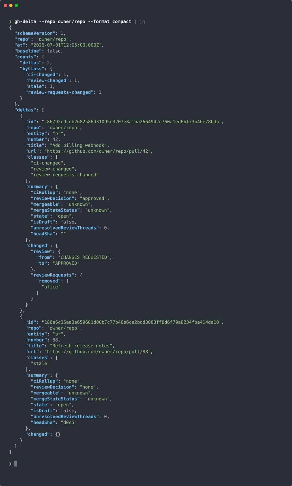
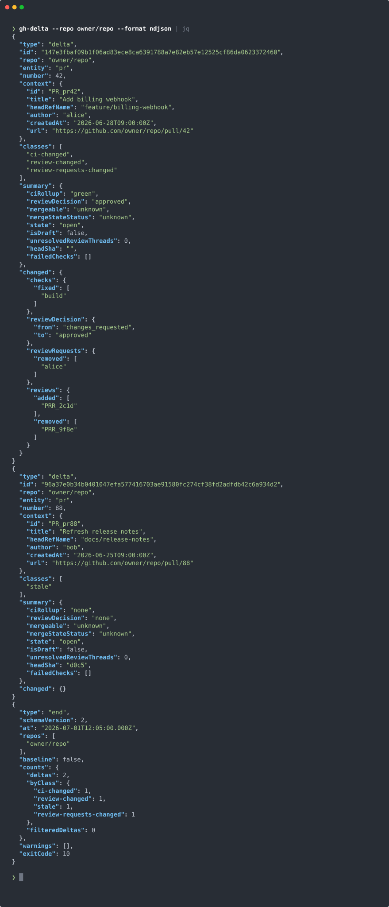
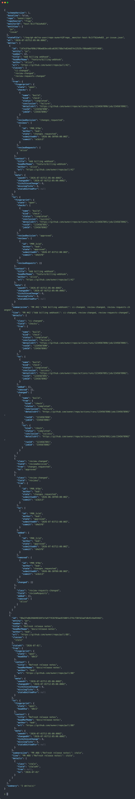
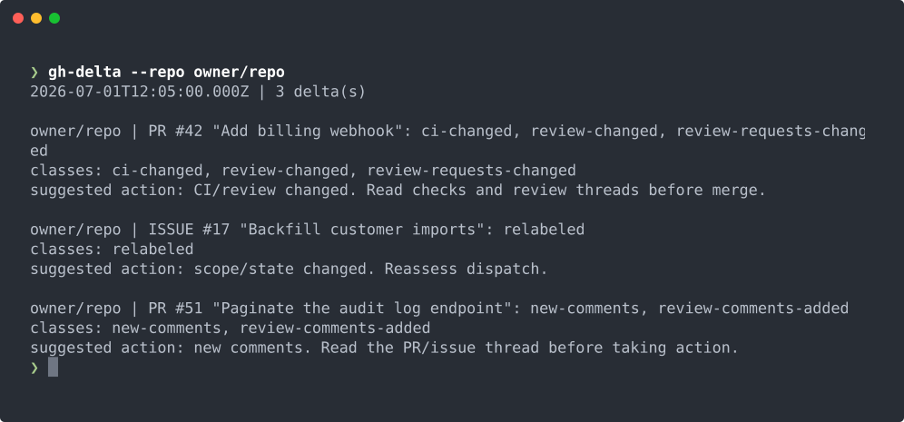
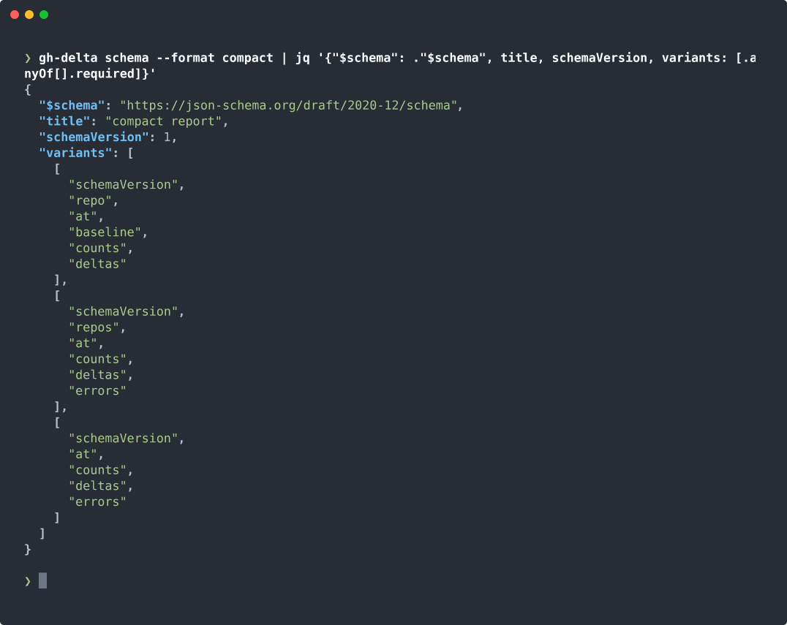

# gh-delta

[](https://www.npmjs.com/package/gh-delta)
[](https://github.com/diegomarino/gh-delta/actions/workflows/ci.yml)

`gh-delta` is a deterministic, one-shot GitHub pull-request and issue detector
for schedulers, scripts, and agent loops. It compares a current observation to
a local snapshot, emits deltas, and leaves the next action to its caller. It is
not a dashboard, inbox, bot, or scheduler.

A common one-minute PR loop lets the terminal history scroll naturally through
the baseline, PR creation, CI starting, a failed job, a corrective push, green
CI, and a final quiet tick that does not replay the change.

<p align="center">
  
</p>

### Try it live

Pick the most recently updated open PR with pending CI in a high-activity public
repository, then poll only that PR once a minute:

```bash
REPO=NousResearch/hermes-agent
DEMO_DIR="${XDG_STATE_HOME:-$HOME/.local/state}/gh-delta-live-demo"
WATCH_DIR="$DEMO_DIR/watch"
# Pick the most recently updated open PR with pending CI.
PR=$(gh search prs --repo "$REPO" --state open --checks pending \
  --sort updated --order desc --limit 1 \
  --json number --jq '.[0].number')

# Save the target locally once; watch add does not query GitHub.
# The loop reuses it to check one PR instead of scanning the whole repository.
npx gh-delta watch add "pr:$PR" \
  --repo "$REPO" \
  --watch-dir "$WATCH_DIR" \
  --until closed \
  --format text

# Check every 60 seconds; the first check establishes the baseline.
while true; do
  npx gh-delta \
    --repo "$REPO" \
    --monitor-id live-demo-60s \
    --state-dir "$DEMO_DIR" \
    --watch-dir "$WATCH_DIR" \
    --entities pr \
    --format text
  sleep 60
done
# Press Ctrl-C to stop.
```

The first tick establishes the baseline; later ticks report only observed
changes, such as pending CI becoming green or failed. Quiet ticks are normal:
even a busy repository cannot guarantee a change to the selected PR every
minute. The watch directory keeps the query economical by fetching that PR
directly instead of scanning the repository's full PR history. Each tick still
uses your shared GitHub GraphQL rate limit, so treat this as a short demo.

## Install

Node 18+ and authenticated GitHub CLI access are required.

```bash
# npm binary
npm install --global gh-delta

# GitHub CLI extension
gh extension install diegomarino/gh-delta
gh delta --version

# agent skill (interactive)
npx skills add diegomarino/gh-delta --skill gh-delta

# or install globally for Codex without prompts, then verify
npx skills add diegomarino/gh-delta --skill gh-delta --agent codex --global --yes
npx skills list --global --agent codex
```

For a one-off run, use `npx gh-delta`. The skill is guidance only: it does not
authorize GitHub mutations.

## Quick start

In a GitHub checkout, create durable local monitor state and take a first tick:

```bash
gh-delta init
gh-delta --format compact
```

`init` writes a non-overwriting `.gh-delta.json` after a baseline. Later ticks
reuse that identity. A first run exits `0`; a changed run exits `10`; exit `1`
is retryable; exit `2` needs configuration or snapshot repair. JSON is always
the default. Use `--format compact` for bounded agent context and `--format
text` for operator logs.

The quick demo below shows the initial baseline followed by a later compact
JSON report after GitHub state changes:

<p align="center">
  
</p>

## Output formats

The same observed change has four representations. Click any preview for the
full-size generated output.

| Agent context                                                                                                                        | Streaming consumers                                                                                                               |
| ------------------------------------------------------------------------------------------------------------------------------------ | --------------------------------------------------------------------------------------------------------------------------------- |
| [`compact`](docs/img/compact-output.svg): bounded summary and semantic changes                                                       | [`ndjson`](docs/img/ndjson-output.svg): one delta per line plus an `end` record                                                   |
| <a href="docs/img/compact-output.svg"></a> | <a href="docs/img/ndjson-output.svg"></a> |
| Full integration contract                                                                                                            | Operator log                                                                                                                      |
| [`json`](docs/img/json-output.svg): complete fingerprints and optional detail                                                        | [`text`](docs/img/text-output.svg): concise human-readable actions                                                                |
| <a href="docs/img/json-output.svg"></a>   | <a href="docs/img/text-output.svg"></a>       |

Schemas are generated from the runtime contract and available without GitHub
access through `gh-delta schema --format compact|ndjson|json`.

<p align="center">
  <a href="docs/img/schema-output.svg"></a>
</p>

## What an agent usually does

| Class                                       | Meaning                             | Usual agent response                                                    |
| ------------------------------------------- | ----------------------------------- | ----------------------------------------------------------------------- |
| `new`, `first-seen`                         | New or newly observed work          | Inspect and queue the item; do not assume ownership.                    |
| `ci-changed`                                | CI state changed                    | Green: inspect review/merge state. Failed: relay the failing check.     |
| `review-changed`, `review-requests-changed` | Review decision or audience changed | Notify the right reviewer or return requested changes to the worker.    |
| `head-changed`, `base-changed`              | Code or target base changed         | Re-check CI and reviews before trusting earlier approval.               |
| `merged`, `closed`, `reopened`              | Lifecycle changed                   | Verify it, then propose branch/work-queue follow-up.                    |
| `new-comments`, `unresolved-threads-added`  | New discussion needs attention      | Read the discussion before merge or dispatch.                           |
| `became-mergeable`, `became-conflicting`    | Mergeability changed                | Inspect protections/conflicts; never merge only because CI is green.    |
| `stale`                                     | No meaningful change for a period   | Send one bounded reminder to the current owner/reviewer.                |
| `missing`, `presumed-deleted`, `reappeared` | Observation continuity changed      | Check scope/permissions; only treat the terminal class as gone.         |
| `updated`, `relabeled`, `assignees-changed` | Other meaningful metadata changed   | Reassess routing and inspect GitHub when the delta lacks enough detail. |

The [contract](docs/contract.md) is canonical for class semantics, exit codes,
schemas, snapshots, and every flag.

## One agent pattern

Wait for a PR’s CI without polling from an LLM turn:

```bash
PR_NUMBER=42
gh-delta wait --repo owner/repo --monitor-id worker-42 \
  --state-dir "${XDG_STATE_HOME:-$HOME/.local/state}/gh-delta" --entities pr --timeout 30m \
  --number "$PR_NUMBER" \
  --until-summary ciRollup=green,failed
```

On exit `10`, inspect the JSON `reason` (`until` or `already-satisfied`) and
the PR before proposing a next action. See the runnable,
network-free [agent worker example](examples/agent-worker-wait/README.md) and
the [fan-out coordinator](examples/coordinator-fanout/README.md) for one-fetch,
many-worker operation.

## Docs

- [Usage](docs/usage.md): installation variants, state identity, watch/outpost
  operation, and programmatic use.
- [Recipes](docs/recipes.md): ten copyable situation → command → response flows.
- [Troubleshooting](docs/troubleshooting.md): auth, snapshots, logs, and errors.
- [Examples](examples/README.md): deterministic local example smokes and
  integration shapes.
- [Agent watch-loop prompt](docs/watch-loop-prompt.md): scheduler-owned loop.
- [Architecture](docs/architecture.md) and [release checklist](docs/release-checklist.md): maintainers.

The official GitHub Action and Homebrew tap are external publication work; this
repository ships only the safe local integration shapes until those artifacts
exist.

## License

[MIT](LICENSE)
