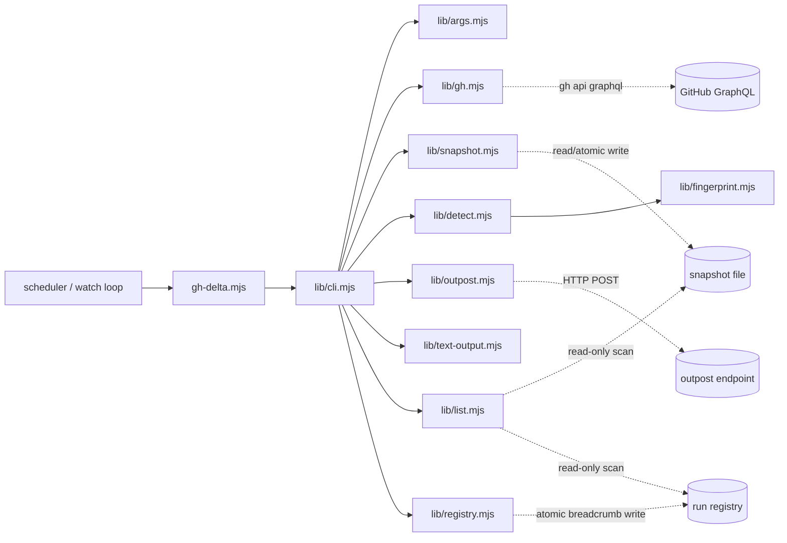
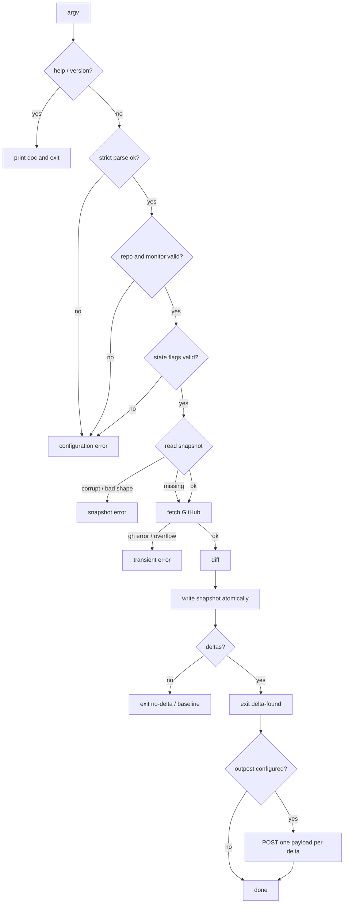
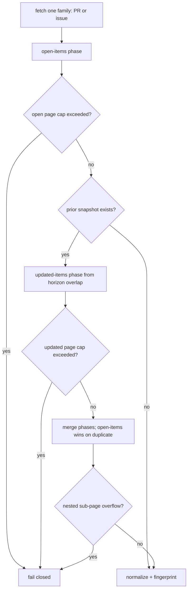

# Architecture

`gh-delta` is intentionally narrow: it turns `(old snapshot, current GitHub
state)` into a categorized delta report. It does not schedule itself, open
browser sessions, merge pull requests, or send messages to workers.

The exact public contract lives in [docs/contract.md](contract.md). This
document explains the module boundaries, runtime flow, and rationale behind that
contract without duplicating the canonical tables.

## Product Boundaries

`gh-delta` separates detection, delivery, and action:

- Detection is authoritative for local comparison and exit-code signals.
- Delivery is optional and best-effort through `--outpost-url`.
- Action planning and execution are always outside this package.

Given identical input snapshot and fetch results, detection output is
deterministic. Scheduling, retries around whole detector runs, queueing, and
downstream decisions belong to the caller.

## Boundaries



The public CLI is one one-shot command. JSON output is for programs; text output
is for operator logs. Neither format creates schedules, timers, automations, or
wake-ups.

## Failure Safety

The design keeps failure modes conservative:

- Argument and snapshot validation happen before writes.
- Snapshots are not updated on error paths.
- Snapshot writes are atomic for a single writer.
- GitHub pagination overflow fails closed instead of silently truncating state.
- Outpost transport failures are warnings and do not turn a successful detection
  into a detector failure.

The exact exit-code taxonomy and error report shape are specified in
[Exit Codes](contract.md#exit-codes) and
[Error Report Shape](contract.md#error-report-shape).

## Runtime Flow

The process entrypoint is deliberately thin:

```text
process argv
  -> choose requested output format
  -> add optional summaryLine/details fields for JSON, or a human line for text
  -> run the detector, with optional outpost delivery
  -> render stdout/stderr
  -> exit with the detector code
```

Run control flow:



Snapshot path selection:

```text
validated args
  -> --state-file present
     -> use that exact path
  -> --state-dir present
     -> derive a monitor-scoped path inside that directory
  -> neither present
     -> derive a per-user path under the system temp directory
     -> guard temp directory ownership on POSIX systems
```

Outpost flow:

```text
detector result
  -> no deltas or error
     -> do not POST
  -> deltas with --outpost-url
     -> snapshot has already advanced
     -> POST one payload per delta
     -> collect delivery failures as warnings
     -> keep the detector result authoritative
```

Exact CLI flags, snapshot derivation rules, output fields, and outpost payloads
are specified in [docs/contract.md](contract.md).

## Module Responsibilities

The core correctness logic is pure:

- `args.mjs` parses reusable CLI argument policy without touching process I/O.
- `fingerprint.mjs` converts GitHub objects into stable fingerprints.
- `detect.mjs` compares fingerprints and emits delta classes.

The impure edges are isolated:

- `gh.mjs` shells out to `gh api graphql` for incremental GraphQL fetches.
- `snapshot.mjs` performs filesystem I/O, derives monitor-scoped snapshot paths,
  and computes the incremental-fetch horizon cutoff.
- `outpost.mjs` validates optional outpost URLs, builds payloads, and sends
  short-timeout HTTP POSTs.
- `text-output.mjs` formats heartbeat text, list inventory text, and outpost
  warnings.
- `list.mjs` builds the read-only monitor inventory for `gh-delta list`:
  decodes derived snapshot filenames, recognizes self-describing snapshot
  `meta` identity, and merges run-registry entries without writing anything.
- `registry.mjs` owns the run-registry boundary: one atomic breadcrumb file per
  monitor in a fixed per-user directory, written best-effort after each
  successful run and read back by `list`.
- `version.mjs` reads package metadata for version output and help JSON.
- `help.mjs` keeps human `--help` and machine-readable `--help-json` output in
  one versioned source of truth.
- `entrypoint.mjs` detects direct CLI invocation through real paths so npm/npx
  `.bin` symlinks start the package bin correctly.
- `lib/cli.mjs` wires CLI flags, GitHub fetches, snapshot I/O, output formats,
  outposts, and exit codes.
- `gh-delta.mjs` is the executable bin entrypoint only. It delegates to
  `lib/cli.mjs` and does not define a public import surface.

## Package Surface

The npm package exposes one CLI and a small explicit ESM import surface. The
package root is intentionally not exported; supported programmatic imports use
subpaths such as `gh-delta/detect` and `gh-delta/outpost`.

The canonical import list lives in
[Programmatic API Surface](contract.md#programmatic-api-surface). Keeping it
there avoids a second exports table drifting from `package.json`.

Everything under `lib/` should stay dependency-free unless the added dependency
materially improves correctness. The package currently has no runtime
dependencies.

## Monitor Identity

`--monitor-id` is the stable identity of a recurring monitor. It is not a branch,
selector, interval, or execution id. Every scheduled fire for the same monitor
should reuse the same `--monitor-id`.

The repo slug is part of derived snapshot identity and outpost identity, so two
monitors with the same monitor id but different repos remain independent.

The default monitor id is designed for zero-config local use. For CI, containers,
renamed hosts, and durable automations, pass an explicit `--monitor-id` and
state location so the watcher does not accidentally start a fresh baseline.

Exact monitor-id grammar, default derivation, state-file behavior, and filename
encoding are specified in [CLI](contract.md#cli) and
[Snapshot Semantics](contract.md#snapshot-semantics).

## GitHub Fetch Strategy

All fetches use `gh api graphql` with updated-at pagination. There are no
`gh pr list` or `gh issue list` subprocess calls.

Incremental fetch strategy per entity family:



Open-items results and updated-items results are merged: the open-items phase
wins on duplicates. Any nested pagination overflow is treated as incomplete
state and fails closed. Exact page-cap values and exit behavior live in
[Exit Codes](contract.md#exit-codes).

Fingerprints track only the GitHub fields needed to detect the public delta
classes. The class list and forward-compatibility policy live in
[Delta Classes](contract.md#delta-classes).

## Snapshot Persistence

`snapshot.mjs` owns the local memory boundary. It reads the previous snapshot,
provides the horizon used by incremental fetches, validates the next snapshot,
and writes atomically beside the target before renaming into place.

Missing snapshots are treated as first runs. Invalid snapshots are permanent
configuration problems, because silently replacing corrupt memory would erase the
watcher's history.

Do not run overlapping ticks against the same state file; use scheduler-level
locking if overlap is possible. Atomic writes prevent partial JSON snapshots,
but they do not make two concurrent detector passes a serialized workflow.

Successful detections are at-most-once from the detector's perspective. The
snapshot advances before an agent acts on deltas and before optional outpost
delivery is attempted. Operators that need at-least-once action delivery should
persist detector output or add an external pending/ack queue.

Snapshot JSON shape and field semantics are specified in
[Snapshot Semantics](contract.md#snapshot-semantics).

## Outpost Edge

`--outpost-url` is an optional edge on `gh-delta.mjs`. It is not part of
`lib/detect.mjs`; the detector still only returns facts.

The outpost path is deliberately small: validate the endpoint, send one payload
per delta after a successful detection, collect warnings, and leave the detector
exit result unchanged. Authentication, retry policy, durable queues, endpoint
filtering, dedupe, and action execution belong downstream.

The exact payload envelope and event identity semantics are specified in
[Outpost Payload](contract.md#outpost-payload-schema-v1).

## Future Entity and Selector Research

The public contract currently supports only `pr`, `issue`, and `pr,issue`.
Research notes under `docs/entities-research/` inventory future entities and
selector applicability. A selector such as `branch` must be validated per entity
before it becomes public; for example, branch selectors can apply to commits or
workflow runs, but not to issues.
