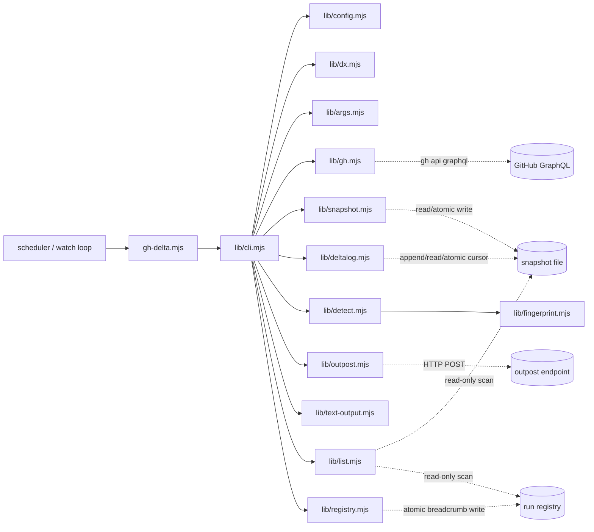
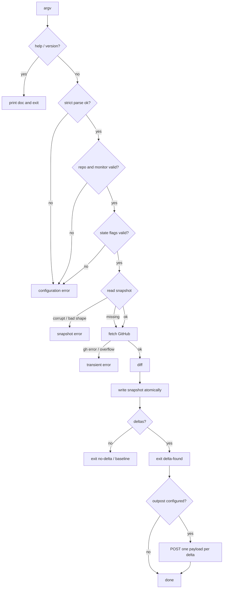
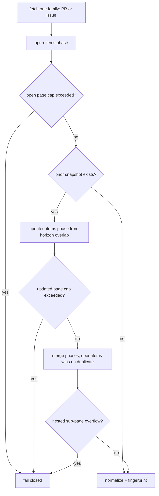

# Architecture

`gh-delta` is intentionally narrow: it turns `(old snapshot, current GitHub
state)` into a categorized delta report. It does not schedule itself, open
browser sessions, merge pull requests, or send messages to workers.

The exact public contract lives in [docs/contract.md](contract.md). This
document explains the module boundaries, runtime flow, and rationale behind that
contract without duplicating the canonical tables.

## Product Boundaries

`gh-delta` separates detection, delivery, and action:

- Detection is authoritative for local comparison and exit-code signals.
- Delivery is optional and best-effort through `--outpost-url`.
- Action planning and execution are always outside this package.

Given identical input snapshot and fetch results, detection output is
deterministic. Scheduling, retries around whole detector runs, queueing, and
downstream decisions belong to the caller.

## Boundaries


```mermaid
flowchart LR
    Sched[scheduler / watch loop] --> Bin[gh-delta.mjs]
    Bin --> CLI[lib/cli.mjs]
    CLI --> Config[lib/config.mjs]
    CLI --> DX[lib/dx.mjs]
    CLI --> Args[lib/args.mjs]
    CLI --> GH[lib/gh.mjs]
    CLI --> Snap[lib/snapshot.mjs]
    CLI --> Log[lib/deltalog.mjs]
    CLI --> Det[lib/detect.mjs] --> FP[lib/fingerprint.mjs]
    CLI --> Out[lib/outpost.mjs]
    CLI --> Txt[lib/text-output.mjs]
    CLI --> Lst[lib/list.mjs]
    CLI --> Reg[lib/registry.mjs]
    GH -. gh api graphql .-> GitHub[(GitHub GraphQL)]
    Out -. HTTP POST .-> Endpoint[(outpost endpoint)]
    Snap -. read/atomic write .-> FS[(snapshot file)]
    Log -. append/read/atomic cursor .-> FS
    Reg -. atomic breadcrumb write .-> RegFS[(run registry)]
    Lst -. read-only scan .-> FS
    Lst -. read-only scan .-> RegFS
```

The public CLI is one one-shot command. JSON output is for programs; text output
is for operator logs. Neither format creates schedules, timers, automations, or
wake-ups.

## Configuration and DX boundaries

`lib/config.mjs` is a pre-parse adapter for detector, wait, status, and the DX
commands, restricted to the public flags accepted by that command. It reads
local JSON configuration and environment defaults, then appends those existing
long flags; validation remains in `lib/cli.mjs`, so flags and configuration
cannot drift into separate semantics or become explain positionals. No
configuration is present means no argv rewrite. `lib/dx.mjs` keeps `init`,
`doctor`, and `explain` policy testable:
init delegates the actual baseline to the existing detector, doctor reads only,
and explain delegates the semantic transition to `diffFingerprint`.

## Failure Safety

The design keeps failure modes conservative:

- Argument and snapshot validation happen before writes.
- Snapshots are not updated on error paths.
- Snapshot writes are atomic for a single writer.
- GitHub pagination overflow fails closed instead of silently truncating state.
- Outpost transport failures are warnings and do not turn a successful detection
  into a detector failure.

The exact exit-code taxonomy and error report shape are specified in
[Exit Codes](contract.md#exit-codes) and
[Error Report Shape](contract.md#error-report-shape).

## Runtime Flow

The process entrypoint is deliberately thin:

```text
process argv
  -> choose requested output format
  -> add optional summaryLine/details fields for JSON, or a human line for text
  -> apply post-detection attention filters (including fail-open ignored-comment authors)
  -> run the detector, with optional outpost delivery
  -> render stdout/stderr
  -> exit with the detector code
```

Run control flow:


```mermaid
flowchart TD
    A[argv] --> B{help / version?}
    B -- yes --> B0[print doc and exit]
    B -- no --> C{strict parse ok?}
    C -- no --> X2[configuration error]
    C -- yes --> D{repo and monitor valid?}
    D -- no --> X2
    D -- yes --> E{state flags valid?}
    E -- no --> X2
    E -- yes --> F{read snapshot}
    F -- corrupt / bad shape --> X2s[snapshot error]
    F -- missing --> G[fetch GitHub]
    F -- ok --> G
    G -- gh error / overflow --> X1[transient error]
    G -- ok --> H[diff]
    H --> I[write snapshot atomically]
    I --> J{deltas?}
    J -- no --> K[exit no-delta / baseline]
    J -- yes --> L[exit delta-found]
    L --> M{outpost configured?}
    M -- yes --> N[POST one payload per delta]
    M -- no --> O[done]
    N --> O
```

Snapshot path selection:

```text
validated args
  -> --state-file present
     -> use that exact path
  -> --state-dir present
     -> derive a monitor-scoped path inside that directory
  -> neither present
     -> derive a per-user path under the system temp directory
     -> guard temp directory ownership on POSIX systems
```

Outpost flow:

```text
detector result
  -> no deltas or error
     -> do not POST
  -> deltas with --outpost-url
     -> snapshot has already advanced
     -> POST one payload per delta
     -> collect delivery failures as warnings
     -> keep the detector result authoritative
```

Exact CLI flags, snapshot derivation rules, output fields, and outpost payloads
are specified in [docs/contract.md](contract.md).

## Module Responsibilities

The core correctness logic is pure:

- `args.mjs` parses reusable CLI argument policy without touching process I/O.
- `fingerprint.mjs` converts GitHub objects into stable fingerprints.
- `detect.mjs` compares fingerprints and emits delta classes.

The impure edges are isolated:

- `gh.mjs` shells out to `gh api graphql` for incremental GraphQL fetches.
- `snapshot.mjs` performs filesystem I/O, derives monitor-scoped snapshot paths,
  and computes the incremental-fetch horizon cutoff.
- `deltalog.mjs` owns opt-in append-only NDJSON validation, sequencing, a
  manifest-published reader boundary, generation-based retention compaction,
  crash-tail recovery, log path derivation, and atomic consumer cursors.
- `outpost.mjs` validates optional outpost URLs, builds payloads, and sends
  short-timeout HTTP POSTs.
- `compact-output.mjs` owns pure compact/NDJSON agent rendering and `diff.mjs`
  owns bounded semantic fingerprint diffs; `schema.mjs` derives published JSON
  Schemas from the runtime catalogs.
- `text-output.mjs` formats heartbeat text, list inventory text, and outpost
  warnings.
- `list.mjs` builds the read-only monitor inventory for `gh-delta list`:
  decodes derived snapshot filenames, recognizes self-describing snapshot
  `meta` identity, and merges run-registry entries without writing anything.
- `registry.mjs` owns the run-registry boundary: one atomic breadcrumb file per
  monitor in a fixed per-user directory, written best-effort after each
  successful run and read back by `list`.
- `version.mjs` reads package metadata for version output and help JSON.
- `help.mjs` keeps human `--help` and machine-readable `--help-json` output in
  one versioned source of truth.
- `entrypoint.mjs` detects direct CLI invocation through real paths so npm/npx
  `.bin` symlinks start the package bin correctly.
- `lib/cli.mjs` wires CLI flags, GitHub fetches, snapshot I/O, output formats,
  outposts, and exit codes.
- `gh-delta.mjs` is the executable bin entrypoint only. It delegates to
  `lib/cli.mjs` and does not define a public import surface.

## Package Surface

The npm package exposes one CLI and a small explicit ESM import surface. The
package root is intentionally not exported; supported programmatic imports use
subpaths such as `gh-delta/detect` and `gh-delta/outpost`.

The canonical import list lives in
[Programmatic API Surface](contract.md#programmatic-api-surface). Keeping it
there avoids a second exports table drifting from `package.json`.

Everything under `lib/` should stay dependency-free unless the added dependency
materially improves correctness. The package currently has no runtime
dependencies.

## Monitor Identity

`--monitor-id` is the stable identity of a recurring monitor. It is not a branch,
selector, interval, or execution id. Every scheduled fire for the same monitor
should reuse the same `--monitor-id`.

The repo slug is part of derived snapshot identity and outpost identity, so two
monitors with the same monitor id but different repos remain independent.

The default monitor id is designed for zero-config local use. For CI, containers,
renamed hosts, and durable automations, pass an explicit `--monitor-id` and
state location so the watcher does not accidentally start a fresh baseline.

Exact monitor-id grammar, default derivation, state-file behavior, and filename
encoding are specified in [CLI](contract.md#cli) and
[Snapshot Semantics](contract.md#snapshot-semantics).

## GitHub Fetch Strategy

All fetches use `gh api graphql` with updated-at pagination. There are no
`gh pr list` or `gh issue list` subprocess calls.

Incremental fetch strategy per entity family:


```mermaid
flowchart TD
    A[fetch one family: PR or issue] --> B[open-items phase]
    B --> C{open page cap exceeded?}
    C -- yes --> X[fail closed]
    C -- no --> D{prior snapshot exists?}
    D -- no --> Z[normalize + fingerprint]
    D -- yes --> E[updated-items phase from horizon overlap]
    E --> F{updated page cap exceeded?}
    F -- yes --> X
    F -- no --> G[merge phases; open-items wins on duplicate]
    G --> H{nested sub-page overflow?}
    H -- yes --> X
    H -- no --> Z
```

Open-items results and updated-items results are merged: the open-items phase
wins on duplicates. Any nested pagination overflow is treated as incomplete
state and fails closed. Exact page-cap values live in
[Fetch limits (page caps)](contract.md#fetch-limits-page-caps); the resulting
exit behavior is specified in [Exit Codes](contract.md#exit-codes).

Fingerprints track only the GitHub fields needed to detect the public delta
classes. The class list and forward-compatibility policy live in
[Delta Classes](contract.md#delta-classes).

## Snapshot Persistence

`snapshot.mjs` owns the local memory boundary. It reads the previous snapshot,
provides the horizon used by incremental fetches, validates the next snapshot,
and writes atomically beside the target before renaming into place.

Missing snapshots are treated as first runs. Invalid snapshots are permanent
configuration problems, because silently replacing corrupt memory would erase the
watcher's history.

Do not run overlapping ticks against the same state file; use scheduler-level
locking if overlap is possible. Atomic writes prevent partial JSON snapshots,
but they do not make two concurrent detector passes a serialized workflow.

Without `--log`, successful detections remain snapshot-at-most-once: the snapshot
advances before an agent acts on deltas and before optional outpost delivery.
With opt-in `--log`, the same existing snapshot lock serializes `append + fsync +
manifest publication` before snapshot publication. The manifest binds the
reader-visible NDJSON prefix, so bytes written before fsync/publication are not
observable by consumers. A crash after a durable append but before snapshot still
creates an at-least-once replay seam: a content-addressed delta id can recur at a
later sequence. Consumer cursors are a local at-most-once convenience, not
acknowledgement; consumers deduplicate work by `id` when they need at-least-once
action delivery.

Consumer mutation is separately scoped: `read --advance` and `cursor set` hold
one `<cursor>.lock` through cursor read, log scan, and replacement. That prevents
same-cursor duplicate delivery and cursor rewind while retaining parallel,
lock-free non-advancing reads and independent cursor files.

Manifest publication also fsyncs its parent directory after atomic rename on
POSIX; Windows uses a writable non-truncating fsync of the final renamed manifest
because Node core cannot portably open a writable directory handle. A failed
durability sync is surfaced as an I/O failure without removing the renamed
manifest, so retry can recover from either durable state.

The initial manifest publishes an empty byte-zero prefix before the first record
write. Legacy readers reconcile a manifest appearing during their read, and all
record boundaries are raw strict-UTF-8 bytes so an invalid byte cannot alter a
published offset through replacement-character decoding.

Snapshot JSON shape and field semantics are specified in
[Snapshot Semantics](contract.md#snapshot-semantics).

## Outpost Edge

`--outpost-url` is an optional edge on `gh-delta.mjs`. `--outpost-secret` may
opt it into HMAC-SHA256 request-body signatures using a named environment
variable; the resolved secret stays on the delivery path and never enters the
report. It is not part of
`lib/detect.mjs`; the detector still only returns facts.

The outpost path is deliberately small: validate the endpoint and secret
configuration, serialize/sign/send one payload
per delta after a successful detection, collect warnings, and leave the detector
exit result unchanged. Authentication, retry policy, durable queues, endpoint
filtering, dedupe, and action execution belong downstream.

The exact payload envelope and event identity semantics are specified in
[Outpost Payload](contract.md#outpost-payload-schema-v2).

## Future Entity and Selector Research

## I-6 watch selection and economical polling

Watch files are monitor-private local JSON state and are validated before a
GitHub fetch. An explicit `--watch-dir` whose `--entities` selection includes
PRs and contains zero to ten PR entries routes through `fetchPRsByNumber`: one
aliased `pullRequest(number:)` GraphQL request
shares the broad PR selection and normalizer, while an empty watch list avoids
GitHub entirely. The targeted universe has its own `__watch-pr.json` (or
`.watch.json` explicit-file sibling), so its lock, delta log, registry record,
report and snapshot never collide with broad polling. Before detection, old
targeted state is projected to current membership: removal is silent, but a
still-watched null alias follows the ordinary missing lifecycle. Lists with an
issue, over ten entries, or `--entities issue` retain broad repository fetches. Terminal cleanup
compares bytes read at tick start before unlinking after snapshot publication.

The public contract currently supports only `pr`, `issue`, and `pr,issue`.
Research notes under `docs/entities-research/` inventory future entities and
selector applicability. A selector such as `branch` must be validated per entity
before it becomes public; for example, branch selectors can apply to commits or
workflow runs, but not to issues.
