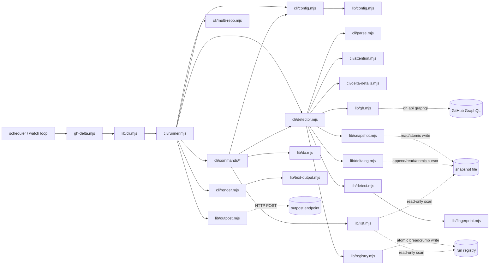

# Product Boundaries

[Documentation](../README.md) · [Architecture by responsibility](../architecture.md)

`gh-delta` separates detection, delivery, and action:

- Detection is authoritative for local comparison and exit-code signals.
- Delivery is optional and best-effort through `--outpost-url`.
- Action planning and execution are always outside this package.

Given identical input snapshot and fetch results, detection output is
deterministic. Scheduling, retries around whole detector runs, queueing, and
downstream decisions belong to the caller.

## Boundaries

The public CLI is one one-shot command. JSON output is for programs; text output
is for operator logs. Neither format creates schedules, timers, automations, or
wake-ups.

## Configuration and DX boundaries

`lib/config.mjs` is a pre-parse adapter for detector, wait, status, and the DX
commands, restricted to the public flags accepted by that command. It reads
local JSON configuration and environment defaults, then appends those existing
long flags; validation remains in the internal CLI modules, so flags and configuration
cannot drift into separate semantics or become explain positionals. No
configuration is present means no argv rewrite. `lib/dx.mjs` keeps `init`,
`doctor`, and `explain` policy testable:
init delegates the actual baseline to the existing detector, doctor reads only,
and explain delegates the semantic transition to `diffFingerprint`.
