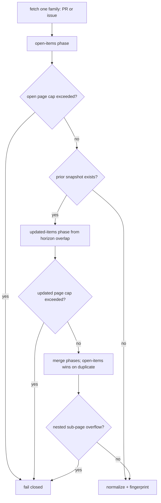

# Monitor Identity

[Documentation](../README.md) · [Architecture by responsibility](../architecture.md)

`--monitor-id` is the stable identity of a recurring monitor. It is not a branch,
selector, interval, or execution id. Every scheduled fire for the same monitor
should reuse the same `--monitor-id`.

The repo slug is part of derived snapshot identity and outpost identity, so two
monitors with the same monitor id but different repos remain independent.

The default monitor id is designed for zero-config local use. For CI, containers,
renamed hosts, and durable automations, pass an explicit `--monitor-id` and
state location so the watcher does not accidentally start a fresh baseline.

Exact monitor-id grammar, default derivation, state-file behavior, and filename
encoding are specified in [CLI](../contract/cli.md#cli) and
[Snapshot Semantics](../contract/snapshots.md#snapshot-semantics).

## GitHub Fetch Strategy

All fetches use `gh api graphql` with updated-at pagination. There are no
`gh pr list` or `gh issue list` subprocess calls.

Incremental fetch strategy per entity family:

Open-items results and updated-items results are merged: the open-items phase
wins on duplicates. Any nested pagination overflow is treated as incomplete
state and fails closed. Exact page-cap values live in
[Fetch limits (page caps)](../contract/snapshots.md#fetch-limits-page-caps); the resulting
exit behavior is specified in [Exit Codes](../contract/exit-codes.md#exit-codes).

Fingerprints track only the GitHub fields needed to detect the public delta
classes. The class list and forward-compatibility policy live in
[Delta Classes](../contract/delta-classes.md#delta-classes).
