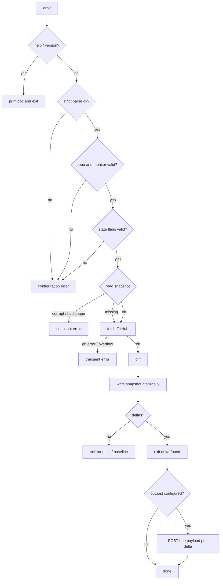

# Failure Safety

[Documentation](../README.md) · [Architecture by responsibility](../architecture.md)

The design keeps failure modes conservative:

- Argument and snapshot validation happen before writes.
- Snapshots are not updated on error paths.
- Snapshot writes are atomic for a single writer.
- GitHub pagination overflow fails closed instead of silently truncating state.
- Outpost transport failures are warnings and do not turn a successful detection
  into a detector failure.

The exact exit-code taxonomy and error report shape are specified in
[Exit Codes](../contract/exit-codes.md#exit-codes) and
[Error Report Shape](../contract/errors.md#error-report-shape).

## Runtime Flow

The process entrypoint is deliberately thin:

```text
process argv
  -> choose requested output format
  -> add optional summaryLine/details fields for JSON, or a human line for text
  -> apply post-detection attention filters (including fail-open ignored-comment authors)
  -> run the detector, with optional outpost delivery
  -> render stdout/stderr
  -> exit with the detector code
```

Run control flow:



Snapshot path selection:

```text
validated args
  -> --state-file present
     -> use that exact path
  -> --state-dir present
     -> derive a monitor-scoped path inside that directory
  -> neither present
     -> derive a per-user path under the system temp directory
     -> guard temp directory ownership on POSIX systems
```

Outpost flow:

```text
detector result
  -> no deltas or error
     -> do not POST
  -> deltas with --outpost-url
     -> snapshot has already advanced
     -> POST one payload per delta
     -> collect delivery failures as warnings
     -> keep the detector result authoritative
```

Exact CLI flags, snapshot derivation rules, output fields, and outpost payloads
are specified in [docs/contract.md](../contract.md).
