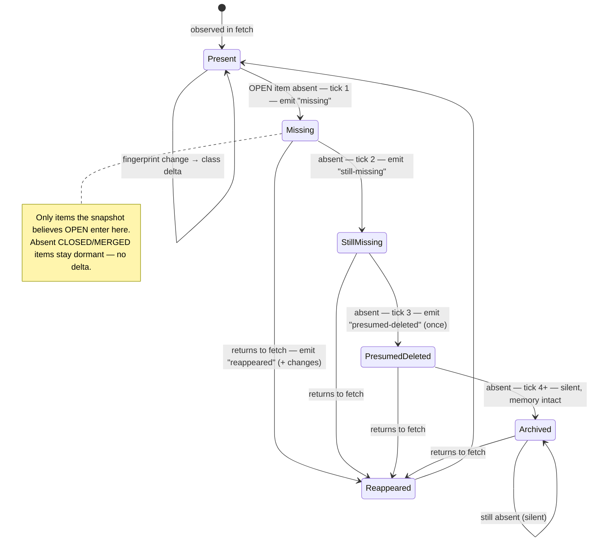
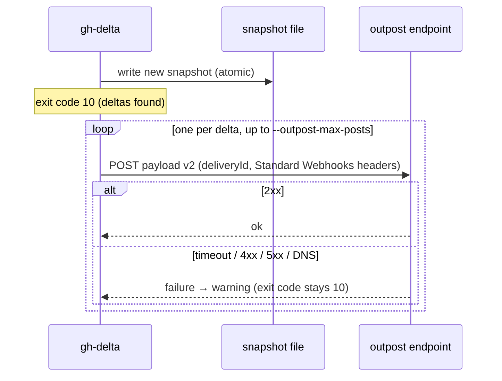

# gh-delta Contract

Canonical, machine-facing contract for `gh-delta`. Other docs link here; do not
duplicate these tables elsewhere (the one exception is the self-contained prompt
in `docs/watch-loop-prompt.md`).

This contract is stable while `report.schemaVersion === 2`. `report.schemaVersion`
identifies the report shape at runtime (see [Report Shape](#report-shape)); a
breaking change bumps it (see [schemaVersion policy](#schemaversion-policy)). The
machine-readable form of this document is available at `gh-delta --help-json`.

A snapshot or durable log written by schema v1 (`meta.schemaVersion` absent, or
present but not `2`) is not migrated: reading it is a permanent `snapshot`/`log`
error hinting at `gh-delta reset` (see [`gh-delta reset`](#gh-delta-reset)). There
is no automatic v1 → v2 upgrade path; re-baseline the monitor instead.

## CLI

```
gh-delta [--repo <owner/name>] [--monitor-id <id>]
         [--state-file <path> | --state-dir <dir>]
         [--entities pr,issue] [--format json|text|compact|ndjson]
         [--summary-line] [--detail] [--summaries] [--full]
         [--stale-after <duration>]
         [--only-classes <classes>] [--ignore-classes <classes>] [--ignore-authors <logins>] [--settled]
         [--baseline-emit-state]
         [--log]
         [--enrich review,comments,threads,body,thread-replies]
         [--outpost-url <url>]
         [--outpost-secret <ENV_VARIABLE_NAME>]
         [--outpost-timeout-ms <ms>] [--outpost-max-posts <n>]
         [--gh-timeout-ms <ms>] [--rate-limit-floor <n>]
         [--no-registry] [--lock-stale-ms <duration>]
```

- `--repo` is **optional**. An explicit value always wins. When omitted,
  `owner/name` is derived from the current directory's git remotes, tried in
  this precedence order:
  1. `origin`, parsed from `git remote get-url origin` — github.com only.
  2. `upstream`, parsed from `git remote get-url upstream` — github.com only.
  3. `gh repo view --json nameWithOwner` — a fallback that covers GitHub
     Enterprise hosts and SSH-config host aliases the URL parser cannot
     identify by hostname alone.
  4. None of the above resolve a repo: the run **declines** with a `config`
     error (exit `2`).

  When `origin` and `upstream` both resolve but to **different** repos,
  `origin` is used and a `warnings` entry (`label: "repo"`) names the repo that
  was set aside; pass `--repo` explicitly to choose the other one. The
  resolved source is echoed on success reports as `results[].repoSource`
  (`"flag"` | `"git-remote"` | `"gh"`) — see [Report Shape](#report-shape).

  **Exit-code note:** a `gh` **timeout while deriving** `--repo` (step 3 above)
  is a `github` error (exit `1`, transient — retry next tick), distinct from
  "no repo derivable" (steps 1–4 all declined), which is a `config` error
  (exit `2`, permanent). This mirrors the general transient/permanent split in
  [Exit Codes](#exit-codes).

- `--monitor-id` is optional. Default: `host-` + the first 12 hex characters of
  the sha1 of hostname plus the Git worktree toplevel (or resolved cwd outside
  Git), so subdirectories share a monitor while separate worktrees do not. The
  hostname and path never appear in reports. `GH_DELTA_MONITOR_ID` supplies an
  environment default, while an explicit `--monitor-id` wins.
- `--repo` must be `owner/name`. **Canonicalized to lowercase** — snapshot paths
  and report echoes always use the lowercased form. This applies whether
  `--repo` was passed explicitly or derived. It may be comma-separated or
  repeated. Two or more explicit repositories run complete ticks serially;
  `--state-file` is rejected for that mode because one file cannot safely
  represent several repositories. Use `--state-dir` or the derived repo-scoped
  paths instead.
- `--monitor-id` must start with a letter or number and contain only letters,
  numbers, dot, underscore, or dash.
- `--state-file` and `--state-dir` are mutually exclusive and **optional**. When
  neither is given, the snapshot lives at
  `<system temp dir>/gh-delta-<user>/repo-<repo>__monitor-<id>__<entities>.json`;
  the directory is per-user (`0700`) and **ephemeral** — reboots and tmp cleanup
  silently re-seed the baseline; pass `--state-dir` explicitly for durable
  monitors. `--state-file` is an explicit snapshot path; `--state-dir` derives a
  path scoped by repo, monitor id, and selected entities (see
  [Snapshot Semantics](#snapshot-semantics)). Both together exit `2` (config).
  An eligible economical `--watch-dir` tick deliberately selects an independent
  derived `__watch-pr.json` path (or `<state-file>.watch.json`) instead.
- `--entities` defaults to `pr,issue`. Accepted: `pr`, `issue`, `pr,issue`.
- `--format` defaults to `json`. `text` is an operator/log mode; `compact` and
  `ndjson` are agent formats. Compact deltas are ordered by requested
  repository, PR before issue, then number; NDJSON finishes with exactly one
  `end` record and newline.

### Project setup, configuration, and local DX commands

`gh-delta init` resolves the current repository (or accepts `--repo`), uses a
durable `--state-dir` (default `.gh-delta` in the checkout), performs one normal
baseline, then atomically creates `.gh-delta.json` only when it did not already
exist. It never overwrites configuration and rejects a temporary state directory.
Its `nextCommand` is `gh-delta`; `--agent` only prints cron, systemd, and prompt
snippets—it never installs a scheduler.

For detector, wait, status, and DX commands, configuration is loaded from
project `.gh-delta.json` then `~/.config/gh-delta/config.json`; only the
existing long flags accepted by that command are applied (so configuration never
supplies a positional). Keys are exactly existing long flag names
(for example `"state-dir"`, `"monitor-id"`, and `"format"`), never a second
grammar. Precedence is explicit flag > `GH_DELTA_<FLAG>` environment value >
project config > user config > current default. With neither config nor relevant
environment value, argv and output remain byte-identical to the legacy path.
`GH_DELTA_FORMAT=text` is supported; the unconditional default remains `json`,
including when stdout is a TTY.

`gh-delta doctor` is read-only and emits one row each for gh installation,
safe `gh auth status --active --hostname <host> --json hosts` authentication,
whether `read:org` is needed, GraphQL quota/reset, state-directory writability,
Node >=18, registry collisions, and temporary-state risk. Exit 0 means required
checks pass; exit 1 means one failed. `gh-delta explain <id>` requires exactly
one explicit `--log-file` or `--report-file`, applies `diffFingerprint` locally,
and never creates hidden last-report state or contacts GitHub. `gh-delta demo`
only prints the fixed public `diegomarino/gh-delta-demo` command.

`--version` prints the package version, distribution channel (`npm`, `gh
extension`, or `brew`), and the GitHub Releases URL. The root `gh-delta` shim
sets the `gh extension` channel; a Homebrew formula can set `GH_DELTA_CHANNEL=brew`.

### gh-delta status

`gh-delta status [--number <numbers>] [--watch-dir <path>] [--refresh]` reads
the monitor snapshot and returns each selected open PR or issue with persisted
`lastChangedAt` and `ticksSinceChange`; PRs also carry their normalized
`summary` (issues have `summary: null`). Without `--refresh` it performs no
GitHub call and writes nothing. `--refresh` performs exactly one normal detector
tick before the local read, while the final status command still exits `0` on
success. A refresh preserves existing stale bookkeeping for unchanged items; a
real fingerprint change resets it. `--number` filters every returned entity. With `--watch-dir`, a local
0-10 PR-only watch universe reads the detector's separate economical watch
snapshot; all other watch lists use the normal snapshot. `text` renders the same
returned items as the JSON report.

`--stale-after <duration>` uses the shared duration grammar. An open item whose
fingerprint has not changed past that threshold emits `stale` once per UTC-day
period. The snapshot persists `staleEmittedFor` outside the compared fingerprint
and clears it on a real change; `staleAt` is included in the stale delta identity
so distinct periods have distinct ids.

## Agent output schemas

`gh-delta schema [--format json|compact|ndjson]` is local-only and emits a
draft-2020-12 schema. Published copies live under `schema/`; `npm run
schema:check` detects drift. All three formats share one `$defs.delta`
fragment; the per-format differences are layered on top of the `$ref` at the
usage site, never by forking the fragment (see
[Report Shape](#report-shape)): `json` additionally requires `from`/`to` on
every delta, `compact` requires neither, and `ndjson` requires its own `type`
discriminator. Compact/NDJSON never include `from`/`to` unless `--full` is set,
and never include `summaryLine` or `details` unless `--summary-line`/`--detail`
is set; each delta always includes `context`, `summary`, and a bounded pure
`changed` fingerprint diff.

- `--summary-line` adds a human-readable `summaryLine` to each delta in JSON
  output. This is for logs and agent messages; do not parse it.
- `--detail` adds structured `details` to each delta and also adds
  `summaryLine`. Prefer `summaryLine` for the human line and `details` /
  `classes` for decisions.
- `--summaries` is a **deprecated no-op**: `delta.summary` is always present now
  (see [Delta Summary schema](#delta-summary-schema)) regardless of this flag.
  It is kept accepted so existing scripts passing it are unaffected; it changes
  nothing.
- `--full` includes the full `from`/`to` fingerprints in compact/ndjson output.
  They are always present in `--format json`; omitted in compact/ndjson unless
  this flag is set.
- `--only-classes <classes>` is an attention filter: keep a delta when it
  carries at least one comma-separated class name. `classes` must contain one
  or more values from `DELTA_CLASSES`; whitespace and duplicate names are
  ignored, and an unknown name is a configuration error (exit `2`).
- `--ignore-classes <classes>` is an attention filter: remove the named
  comma-separated `DELTA_CLASSES` values from every delta, then drop a delta
  left with no classes. It has the same validation, whitespace, and duplicate
  behavior as `--only-classes`.
- `--ignore-authors <logins>` is a comma-separated, case-insensitive list of
  non-empty GitHub logins. It is a post-detection attention filter covering
  three surfaces: it removes `new-comments` only when the positive
  `conversationComments` increment fits the observed final comment rows and
  every inferred row has an id and a listed author; it removes `review-changed`
  the same way against `reviews`; and it removes `review-comments-added` the
  same way against the affected review threads' reply increments. It fails
  open on overflow, missing id/author, aggregate/observed-count mismatch, or
  other uncertainty. Snapshots still advance; `filteredDeltas` is present
  whenever this flag is supplied.

  **The one pre-publish quota exception:** when `--ignore-authors` and
  `--enrich thread-replies` are both set, `thread-replies` is additionally
  fetched once, scoped to filtering only, **before** the snapshot/log write —
  the single documented case where opt-in enrichment quota is spent before
  publication (every other `--enrich` fetch runs after). It never populates
  `delta.enrichment` before publication; that still only happens through the
  ordinary post-publish enrichment pass. Without the double opt-in
  (`--ignore-authors` alone, without `--enrich thread-replies`), a
  `review-comments-added` delta whose reply authors cannot be verified fails
  open with an explicit warning instead of guessing.

- `--settled` is an attention filter that drops a delta whose normalized summary
  has `ciRollup: "pending"` or `mergeable: "unknown"`. It implies `summary` is
  read (which is now unconditional); no explicit `--summaries` flag is needed.
  `ciRollup: "none"` is settled and is kept.

**Attention filters are not a queue: detection and the snapshot still advance
for filtered changes, and filtered changes are not replayed later.** When flags
are combined, their order is binding: `--only-classes`, then
`--ignore-classes`, then `--ignore-authors`, then empty-delta removal, then `--settled`.
`filteredDeltas` counts only deltas removed entirely; removing one class from a
surviving multi-class delta does not increment it.

- `--baseline-emit-state` is optional and off by default. On the run that seeds a
  baseline, it emits one synthetic `baseline-state` delta per tracked OPEN item
  (`from: null`, `to`: the observed item) so state that already existed at
  baseline is visible instead of silent until the item next changes. The run then
  exits `10` with `baseline: true` and a non-empty `deltas` array; ids are stable
  across re-baselining. Without the flag, baseline behavior is byte-identical. See
  the [`baseline-state`](#delta-classes) class and [Exit Codes](#exit-codes).
- `--log` is optional and off by default. It appends each surviving post-filter,
  post-decoration delta to a monitor-bound NDJSON journal, fsyncs it, then
  atomically publishes its reader-visible boundary before snapshot publication.
  Its path is `<stateDir>/log-<encoded repo>__monitor-<encoded
monitorId>__<entities>.ndjson`, or `<state-file>.deltalog.ndjson` for an explicit
  state file. The success report adds absolute `results[].logFile`, including
  on zero-delta ticks; zero-delta ticks do not open the log. Without `--log`
  that field is omitted and the log module is never opened.
- `--enrich review,comments,threads,body,thread-replies` is a comma-separated,
  deduplicated selection of body fetches, off by default. After a successful
  snapshot write only, it fetches bodies for matching emitted deltas:
  `review-changed` (`review`), `new-comments` (`comments`),
  `unresolved-threads-added` (`threads`), `new`/`first-seen`/`reopened`/
  `baseline-state` (`body` — one `nodes()` call per delta for the item's own
  body, attached as `enrichment.body = { body, mentions }`; never called for a
  plain `updated`), or `review-comments-added` (`thread-replies` — one aliased
  per-thread GraphQL call per delta, each thread's own `comments(last: N)`
  where `N` is that thread's reply-count increment). Failures are warnings and
  never change detection state. See the `--ignore-authors` bullet above for the
  one pre-publish exception.
- `--outpost-url` is optional at-most-once HTTP delivery; see
  [Outpost Payload](#outpost-payload-schema-v2). It does not affect the JSON
  report, exit code, or snapshot.
- `--outpost-secret` names (never contains) an environment variable holding the
  shared HMAC secret. It requires `--outpost-url`; invalid names and unset or
  empty values are configuration errors before repository derivation or I/O.
- `--outpost-timeout-ms` timeout in milliseconds for each outpost HTTP POST
  (default `4000`).
- `--outpost-max-posts` maximum number of outpost POSTs per run (default:
  unlimited). Excess deltas are skipped with an outpost warning.
- `--gh-timeout-ms` timeout in milliseconds for each `gh` subprocess call
  (default `60000`).
- `--rate-limit-floor <n>` is an opt-in pre-fetch GraphQL quota floor. `n` is a
  non-negative safe integer. After acquiring the state lock and validating the
  current snapshot, the detector reads `resources.graphql.remaining` from one
  `gh api rate_limit` call immediately before the observation fetch. Equality
  proceeds. A lower remaining quota exits `1` with `kind: "rate-limit"`, a
  stable message naming both values, and top-level ISO-8601 UTC `resetAt`; it
  leaves the snapshot, log, outpost, and watch cleanup untouched. A malformed
  or failed rate-limit request remains the ordinary transient `github` error.
  Omitted means no rate-limit call and byte-identical legacy behavior.
- `--no-registry` skips the best-effort [run-registry](#run-registry) breadcrumb
  this run would otherwise leave for `gh-delta list`. Equivalent to setting
  `GH_DELTA_NO_REGISTRY=1`. It never affects the report, exit code, or snapshot.
- `--lock-stale-ms` is optional (default `10m`; grammar shared with `--since`,
  see [`parseDuration`](#programmatic-api-surface)). It is a ceiling on how old
  an **unreadable/corrupt** state-file lock must be before it is presumed
  abandoned and stolen (with a warning). It does **not** apply to a readable
  lock — that one is only ever stolen once its own `expiresAt` has passed. See
  [Lock Semantics](#lock-semantics).

**Repeated flags:** the last value wins. This applies to both class-list flags;
duplicate class names within one comma-separated list are ignored. **`--help`, `--help-json`, and
`--version` take precedence over all validation** — an agent probing with
`--help-json` receives the help document even when the rest of the command line
is invalid.

### gh-delta list

```
gh-delta list [--state-dir <dir>] [--since <duration>] [--format json|text]
```

Read-only inventory of the monitors that have run on this machine. `list` never
contacts GitHub and never creates, updates, or deletes snapshots or registry
entries, so it is safe to run at any time, including while monitors tick.

- **Scope.** Without `--state-dir` the inventory is **global**: the
  [run registry](#run-registry) — which every successful detector run feeds
  unless opted out — merged with a scan of the per-user temp default location.
  Monitors using any `--state-dir` or an explicit `--state-file` appear via
  their registry entries. With `--state-dir`, the inventory narrows to a plain
  scan of that directory and the registry is not consulted.
- A scan identifies a snapshot two ways: the derived filename (encodes repo,
  monitor id, and entities), or — for arbitrary filenames — the identity the
  detector stamps inside the snapshot (`meta.repo`, `meta.monitorId`,
  `meta.entities`; see [Snapshot Semantics](#snapshot-semantics)). Economical
  PR-watch entries additionally expose `scope: "watch-pr"`. Files
  identified neither way are counted in `skippedFiles`.
- A missing state directory or registry is an empty inventory (exit `0`), not
  an error.
- `--since` is optional. Grammar: a positive integer followed by one unit —
  `s`, `m`, `h`, or `d` (e.g. `90s`, `15m`, `24h`, `7d`). Only monitors whose
  `lastRun` falls inside the window are listed. Without it, every known monitor
  is listed.
- `--format` defaults to `json`; `text` is the operator/log mode.
- `--help`, `--help-json`, and `--version` follow the same indestructible-help
  precedence as the detector; `gh-delta list --help-json` documents this
  subcommand.

Success report (exit `0`; the shape is also available as `reportFields` /
`monitorFields` in `gh-delta list --help-json` and as `LIST_REPORT_FIELDS` /
`LIST_MONITOR_FIELDS` in `gh-delta/contract`):

```json
{
  "schemaVersion": 2,
  "command": "list",
  "stateDir": "/tmp/gh-delta-user",
  "registryDir": "/home/user/.local/state/gh-delta/registry",
  "since": "24h",
  "at": "2026-07-08T12:00:00.000Z",
  "monitors": [
    {
      "repo": "owner/repo",
      "monitorId": "prs-5m",
      "entities": ["pr"],
      "schemaVersion": 2,
      "stateFile": "/srv/state/repo-owner%2Frepo__monitor-prs-5m__pr.json",
      "lastRun": "2026-07-08T11:00:00.000Z",
      "prCount": 12,
      "issueCount": 0
    }
  ],
  "skippedFiles": 0,
  "summary": "1 monitor(s)"
}
```

- `command` (string): always `"list"`; discriminates this report from a
  detector report.
- `registryDir` (string|null): the run-registry directory consulted, or `null`
  when `--state-dir` narrowed the inventory to a scan.
- `since` (string|null): the echoed `--since` value, or `null` when no window
  was given.
- `monitors` (array): sorted by `lastRun`, newest first. `lastRun` is the
  snapshot's `meta.horizon` when readable; the registry `lastRun` or file mtime
  otherwise (corrupt or unreadable snapshots). A corrupt snapshot keeps its
  entry with an `error` string and `null` counts instead of failing the
  listing. A registered monitor whose snapshot file no longer exists keeps its
  entry with `stale: true` — a retired monitor or cleaned state, reported
  rather than hidden. `schemaVersion` (number|null) is the snapshot's
  `meta.schemaVersion` when the snapshot is readable, `null` otherwise — a
  monitor stuck on a pre-schema-v2 snapshot needs `gh-delta reset`. Additive
  diagnostics are `lastAttemptAt`, `lastOkAt`, `lastError` (`null` or
  `{kind,message,at}`), `observationAgeMs`, and `snapshotStatus` (`present`,
  `corrupt`, `expected-missing`, or `not-yet-created`). `--since` filters by
  the same successful-observation timestamp; a failed first attempt has no
  observation and does not pass it.
- `skippedFiles` (number): directory or registry entries that could not be
  identified as monitor snapshots or registry entries. They are counted, never
  guessed at.
- `summary` (string): human-readable only; do not parse it.

Exit codes: `0` inventory produced (possibly empty), `1` transient error (state
directory unreadable), `2` permanent error (invalid arguments). `list` never
exits `10`. Error reports use the standard
[error report shape](#error-report-shape).

### gh-delta reset

```
gh-delta reset --repo <owner/name> --monitor-id <id>
  (--state-file <path>|--state-dir <dir>) --yes
  [--entities pr,issue] [--format json|text]
```

Deletes one monitor's snapshot and durable log to start a clean baseline. This
is the documented recovery for a monitor stuck on an unreadable or
pre-schema-v2 snapshot/log — schema v1 is never migrated (see the note at the
top of this document). It takes the monitor's state-file lock for the whole
operation and releases it last, so a concurrent tick blocked on the same lock
either sees the fully intact pre-reset state or the fully clean post-reset
state, never a half-deleted monitor. Deletes the snapshot file, the log's
published manifest, and the log's physical data file. `--yes` is required;
without it, reset is refused before the lock is even acquired. A monitor with
nothing on disk resets successfully as a no-op.

The success report carries the deleted `stateFile` and `logFile` paths (see
`RESET_REPORT_FIELDS` in `gh-delta/contract`).

**External cursor behavior after reset.** An external consumer cursor bound to
the deleted log now points past its (fresh, empty) tail — `seq > 0` against a
log with `lastSeq: 0`. `gh-delta read` / `cursor set` **reject** it with
`kind: "log"` naming the cursor seq and the tail, rather than silently
restarting delivery from the new `firstSeq`. This is deliberate: a silent
restart would re-deliver history the consumer already believes it has
consumed. Delete the stale cursor file to resume (tested at
`test/deltalog.test.mjs`, "a cursor pointing past the tail of a reset (deleted)
log is a clear log error, not a silent restart").

Exit codes: `0` reset completed (including a no-op reset of a clean monitor),
`1` filesystem or lock-busy error, `2` invalid arguments or `--yes` not passed.

**Irreversible:** the snapshot and durable log are deleted, not archived.

### gh-delta read

```
gh-delta read --cursor <path>
  [--only-classes <classes>] [--number <positive integer>]
  [--advance] [--format json|text]
```

Reads only the existing cursor-bound log: no GitHub call, snapshot read/write,
lock, or registry access. `--only-classes` accepts known `DELTA_CLASSES`; `--number`
filters GitHub item number, not result count. It always scans complete records to
EOF, so `cursor.to` includes entries rejected by consumer filters. Without
`--advance` the cursor bytes are unchanged; with it, the cursor is atomically set
to that scanned tail after the report is assembled. Exit `10` means returned
`deltas` is nonempty. A missing cursor, invalid cursor, or malformed complete log
record is `kind: "log"` / exit `2`; a missing log is empty only at cursor seq `0`.

### gh-delta wait

```
gh-delta wait --timeout <duration>
  [--until <classes>] [--until-summary <field=value[,value...]>]
  [--interval <duration>] [--max-interval <duration>] [--backoff <positive number>]
  [--settle <duration>] [--heartbeat-file <path>] [--progress]
  [--from-log --cursor <path>]
  [detector options]
```

`wait` supports only `--format json`; agent compact and NDJSON envelopes do not
carry the wait command's required `reason` and `iterations` fields.

`wait` is a bounded worker loop. It runs a normal detector tick per iteration,
so snapshots advance and each state-file lock is acquired and released within
that iteration; it is never held while sleeping. `--timeout` is required.
`--until` matches a future emitted delta class. By contrast, `--until-summary`
tests the current normalized PR summary on the first iteration too: an already
matching state exits `10` with `reason: "already-satisfied"`. Values after `=`
are alternatives, so `ciRollup=failed,green` matches either state. A matching
future delta exits `10` with `reason: "until"`; expiry exits `0` with
`reason: "timeout"`.
`--settle` keeps polling and accumulating after the first match until its
settle deadline (or SIGTERM), so checks that complete together are delivered in
one report.

The final JSON report has `command: "wait"`, the resolved `repo` (or aggregate
`repos`) and `monitorId` when a detector tick ran, accumulated `deltas`,
`iterations`, `reason`, and a human-only `summary`. A tick or heartbeat failure
uses the standard error envelope instead; successful reasons are only `until`,
`already-satisfied`, `timeout`, or `signal`.
`--heartbeat-file` exists before the first tick and is touched once per
completed iteration; its default is `<stateFile>.hb`, or `<cursor>.hb` for
`--from-log`. `--progress` writes one NDJSON `{type:"tick",at,deltas}` record
to stderr immediately after each completed iteration and leaves stdout solely
for the final report. `--from-log` requires `--cursor` and repeatedly uses the
local durable log reader instead of running detector ticks: it never invokes
GitHub. Its `--number` filter is passed to the log reader, and
`--until-summary` is derived from each logged delta's `to` fingerprint, never a
previously rendered summary. Wait rejects every `--outpost-*` flag. `SIGTERM`
stops after the current iteration, prints the accumulated report, and exits `0`
with `reason: "signal"`.

### gh-delta cursor set

```
gh-delta cursor set <cursor-path> <seq> [--log-file <path>] [--format json|text]
```

Initializes a missing cursor only with `--log-file` (normalized absolute). An
existing cursor stays bound to its log; a supplied `--log-file` must match. `seq`
is a non-negative safe integer and may move backwards for replay, but cannot be
above the complete log tail. A missing log permits only seq `0`. Success is exit
`0`; cursor replacement is atomic.

## Run Registry

The registry is how `gh-delta list` sees monitors whose snapshots live outside
any directory it could guess — an arbitrary `--state-dir` or an explicit
`--state-file`. After every resolved detector attempt, including a failure, the
CLI writes one small breadcrumb per monitor:

- **Location:** `$GH_DELTA_REGISTRY_DIR` when set, otherwise
  `$XDG_STATE_HOME/gh-delta/registry`, falling back to
  `~/.local/state/gh-delta/registry`. Durable on purpose — unlike the temp-dir
  snapshot default, a reboot must not erase the inventory.
- **Shape:** one JSON file per monitor, keyed by a sha256 hash of the canonical
  snapshot path (case-folded on Windows; see [Platform Notes](#platform-notes)), containing `registryVersion`, `repo`, `monitorId`, `entities`,
  `stateFile`, `lastRun`, `machineId`, `lastAttemptAt`, `lastOkAt`, and
  `lastError` (the field catalog is `REGISTRY_ENTRY_FIELDS` in
  `gh-delta/contract`). Re-registering the same monitor overwrites its own
  file (temp file + atomic rename): idempotent, last-writer-wins, and
  concurrent monitors never share a file — no locks.
- **Best-effort:** a registry write failure is silent and never changes the
  detector report, exit code, or snapshot. The registry is an **index, not
  detector state**: deleting the directory is always safe; it rebuilds as
  monitors run, and losing it never causes false deltas or re-baselines.
- **Opt-out:** `--no-registry` per run, or `GH_DELTA_NO_REGISTRY=1` in the
  environment (hermetic CI, ephemeral containers).
- The detector never deletes registry entries. `gh-delta list` reports orphans
  as `stale: true`; cleanup is a future explicit command.
- **Programmatic use is unaffected:** the registry lives in the CLI layer.
  Importing `gh-delta/detect`, `gh-delta/snapshot`, or any other subpath never
  touches it. Orchestrators that want their embedded monitors to appear in
  `gh-delta list` can opt in via `registerMonitor` from `gh-delta/registry`.

## Exit Codes

- `0`: baseline established, no deltas, or no surviving deltas after attention
  filtering.
- `10`: deltas found. Also emitted when `--baseline-emit-state` seeds a baseline
  that observes at least one tracked open item: the report then carries
  `results[].baseline: true` **and** a non-empty `deltas` array of
  `baseline-state` deltas. Watchers that chain on exit `10` feed this baseline
  report like any other.
- `1`: **transient error** — GitHub CLI, network, timeout, snapshot write
  failure, or a busy state-file lock (`kind: "busy"`, see
  [Lock Semantics](#lock-semantics)). The snapshot is not updated; the next
  scheduled tick should retry automatically.
- `2`: **permanent error** — invalid configuration or unreadable / invalid-shape
  / pre-schema-v2 snapshot. Retrying will not help; a human must fix the issue
  before the next tick (see [`gh-delta reset`](#gh-delta-reset)).

## Programmatic API Surface

The package publishes a small, explicit ESM surface. Imports must use explicit
subpaths; the package root is intentionally not exported.

| Export path            | Symbols                                                                                                                                                                                                                                                                                                                                                                                                                                                                                                                                                                                                                                                                                    | Purpose                                                       |
| ---------------------- | ------------------------------------------------------------------------------------------------------------------------------------------------------------------------------------------------------------------------------------------------------------------------------------------------------------------------------------------------------------------------------------------------------------------------------------------------------------------------------------------------------------------------------------------------------------------------------------------------------------------------------------------------------------------------------------------ | ------------------------------------------------------------- |
| `gh-delta/detect`      | `detectDeltas`, `threadSetDiff`                                                                                                                                                                                                                                                                                                                                                                                                                                                                                                                                                                                                                                                            | Pure delta classification engine                              |
| `gh-delta/diff`        | `diffFingerprint`                                                                                                                                                                                                                                                                                                                                                                                                                                                                                                                                                                                                                                                                          | Bounded, pure `delta.changed` fingerprint diff                |
| `gh-delta/deltalog`    | `deltaLogPath`, `appendDeltaLog`, `readDeltaLog`, `readCursor`, `setCursorAtomic`, `resetDeltaLog`                                                                                                                                                                                                                                                                                                                                                                                                                                                                                                                                                                                         | Durable NDJSON journal and atomic consumer cursors            |
| `gh-delta/fingerprint` | `prFingerprint`, `issueFingerprint`, `buildChecks`, `buildReviews`, `buildThreads`, `stableValue`, `deltaIdentity`, `deltaId`                                                                                                                                                                                                                                                                                                                                                                                                                                                                                                                                                              | Stable object fingerprint builders and delta-id hashing       |
| `gh-delta/duration`    | `parseDuration`                                                                                                                                                                                                                                                                                                                                                                                                                                                                                                                                                                                                                                                                            | Shared duration grammar for every duration-valued flag        |
| `gh-delta/wait`        | `runBoundedWait`                                                                                                                                                                                                                                                                                                                                                                                                                                                                                                                                                                                                                                                                           | Bounded worker loop over caller-supplied complete ticks       |
| `gh-delta/list`        | `listMonitors`, `parseSnapshotFilename`, `parseSince`                                                                                                                                                                                                                                                                                                                                                                                                                                                                                                                                                                                                                                      | Read-only monitor snapshot inventory                          |
| `gh-delta/registry`    | `registerMonitor`, `readRegistry`, `defaultRegistryDir`, `registryEntryPath`, `canonicalStateFileKey`, `REGISTRY_VERSION`                                                                                                                                                                                                                                                                                                                                                                                                                                                                                                                                                                  | Run-registry breadcrumbs for gh-delta list                    |
| `gh-delta/outpost`     | `buildOutpostPayload`, `outpostSignature`, `validateOutpostUrl`, `postOutpost`, `sendOutposts`                                                                                                                                                                                                                                                                                                                                                                                                                                                                                                                                                                                             | Outpost payload and transport helpers                         |
| `gh-delta/snapshot`    | `readSnapshot`, `snapshotPath`, `economicalSnapshotPath`, `writeSnapshotAtomic`, `defaultStateDir`, `horizonCutoff`, `SNAPSHOT_SCHEMA_VERSION`                                                                                                                                                                                                                                                                                                                                                                                                                                                                                                                                             | Snapshot path and persistence helpers                         |
| `gh-delta/lock`        | `acquireLock`, `releaseLock`, `assertLockOwned`, `lockPath`, `LOCK_EXPIRY_SLACK_MS`                                                                                                                                                                                                                                                                                                                                                                                                                                                                                                                                                                                                        | State-file lock: one writer per `(repo, monitorId, entities)` |
| `gh-delta/args`        | `parseEntitySelection`, `validateRepo`, `validateMonitorId`, `canonicalEntityKey`, `defaultMonitorId`                                                                                                                                                                                                                                                                                                                                                                                                                                                                                                                                                                                      | Shared argument parsing policies                              |
| `gh-delta/version`     | `getPackageMetadata`, `renderVersionText`                                                                                                                                                                                                                                                                                                                                                                                                                                                                                                                                                                                                                                                  | Package metadata and version output                           |
| `gh-delta/config`      | `applyConfig`, `CONFIG_KEYS`                                                                                                                                                                                                                                                                                                                                                                                                                                                                                                                                                                                                                                                               | Local configuration and flag-precedence helpers               |
| `gh-delta/dx`          | `initializeMonitor`, `writeConfigDurableNoOverwrite`, `runDoctorChecks`, `explainDelta`, `isTemporaryPath`                                                                                                                                                                                                                                                                                                                                                                                                                                                                                                                                                                                 | Local init, diagnostics, and persisted-delta explanation      |
| `gh-delta/contract`    | `REPORT_SCHEMA_VERSION`, `OUTPOST_SCHEMA_VERSION`, `REPORT_FIELDS`, `REPORT_RESULT_FIELDS`, `DELTA_FIELDS`, `DELTA_CONTEXT_FIELDS`, `DELTA_DETAIL_FIELDS`, `DELTA_DETAIL_FIELDS_BY_CLASS`, `DELTA_CLASSES`, `ERROR_KINDS`, `LIST_REPORT_FIELDS`, `LIST_MONITOR_FIELDS`, `REGISTRY_ENTRY_FIELDS`, `DELTA_SUMMARY_FIELDS`, `DELTA_SUMMARY_ENUMS`, `DELTA_LOG_RECORD_FIELDS`, `CURSOR_FILE_FIELDS`, `READ_REPORT_FIELDS`, `READ_CURSOR_FIELDS`, `COMPACT_REPORT_FIELDS`, `COMPACT_BOUNDS_FIELDS`, `RESET_REPORT_FIELDS`, `CURSOR_SET_REPORT_FIELDS`, `CURSOR_SET_CURSOR_FIELDS`, `WAIT_REPORT_FIELDS`, `AGENT_COMPACT_REPORT_FIELDS`, `AGENT_COMPACT_DELTA_FIELDS`, `AGENT_NDJSON_END_FIELDS` | Runtime contract constants and field catalogs                 |

Behavioral notes for consumers:

- `detectDeltas` is pure: pass old and current collections and consume
  `baseline`, `deltas`, and replacement `snapshot`.
- `diffFingerprint(from, to, { arrayLimit = 20 })` builds the bounded `changed`
  diff every delta carries: identity-keyed arrays (`reviews`, `threads`,
  `recentComments`) name added/removed/changed rows by `id`; `checks` names
  `failed`/`fixed`/`changed` by check name; set-style string arrays (`labels`,
  `assignees`, `reviewRequests`) name added/removed; everything else is a
  scalar `{from, to}` transition. Every array result caps at `arrayLimit`
  entries and adds `truncated: true` past that bound.
- `buildOutpostPayload` already includes a deterministic `deliveryId` (send-attempt
  identity) and a fallback content-addressed `delta.id` when the caller's delta
  does not already carry one (see [Outpost Payload](#outpost-payload-schema-v2)).
- `postOutpost` throws on HTTP failures so callers can classify transport errors.
- `readSnapshot` throws on malformed JSON or a `meta.schemaVersion` other than
  the current `SNAPSHOT_SCHEMA_VERSION`; callers should treat this as
  recoverable only via `gh-delta reset`, never by migrating the file in place.
- `parseDuration(raw, { flag })` is the single implementation of the duration
  grammar (a positive integer followed by `s`, `m`, `h`, or `d`). `parseSince` is
  a thin wrapper over it that fixes `flag` to `--since`; every future
  duration-valued flag must use `parseDuration` rather than restate the grammar.
- `appendDeltaLog` fsyncs complete NDJSON records, then atomically publishes a
  versioned reader boundary; `readDeltaLog` validates every published record and
  never exposes an unpublished suffix. Complete malformed or noncontiguous
  records are permanent errors. `setCursorAtomic` replaces a validated,
  absolute-bound cursor through a same-directory atomic rename. `resetDeltaLog`
  deletes a log's manifest and data file; it is idempotent against an
  already-clean (never-appended) log.
- `snapshotPath` is deterministic and scoped by repo, monitor-id, and entity set;
  `economicalSnapshotPath` derives the independent bounded-watch sibling.
- `horizonCutoff` derives the incremental-fetch cutoff from a prior snapshot
  (`meta.horizon` minus the overlap); a `null` snapshot yields `null`
  (open-items-only fetch).
- `prFingerprint`/`issueFingerprint` build the compared subset directly from an
  already-normalized PR/issue row (see [Fingerprint fields](#fingerprint-fields-from--to)
  for the exact shape `lib/gh.mjs` normalizes into); there is no drop-list —
  every key on the returned object participates in the comparison and the
  delta id.
- `stableValue` recursively key-sorts an object so GitHub's field ordering never
  changes a fingerprint hash or a delta `id`.
- `deltaIdentity` builds the `{ repo, entity, number, to }` (or, when `to` is
  `null`, `{ repo, entity, number, from, classes, missingTicks }`) object that
  `deltaId` hashes into the content-addressed `id` on every delta.
- `deltaId` returns the full 64-character sha256 hex of a canonicalized delta
  identity; pair it with `deltaIdentity` at the report-assembly layer.
- `defaultMonitorId` derives the zero-config `--monitor-id` default (`host-` +
  the first 12 hex characters of the sha1 of `os.hostname()`).
- `REGISTRY_VERSION` is the integer schema version stamped into every
  run-registry breadcrumb file.
- `acquireLock`/`releaseLock`/`assertLockOwned` implement the state-file lock
  described in [Lock Semantics](#lock-semantics); a library caller embedding
  the detector directly (rather than through the CLI) is responsible for
  calling them around its own read-fetch-write cycle if it wants the same
  one-writer-per-state-file guarantee `gh-delta` enforces at the CLI layer.
- `runBoundedWait` owns the bounded sleep/heartbeat/signal loop behind the
  `wait` subcommand. Its injected `tick` boundary is intentionally lock-free
  between calls; callers provide one complete lock-scoped operation per tick.

The exit code is the primary machine signal. Branch on it before reading stdout:
codes `1` and `2` produce an [error report](#error-report-shape) with no
`deltas` field.

## Delta Classes

Closed set while `report.schemaVersion === 2`. Every delta carries at least one class; `classes`
is **never empty** (`updated` is the catch-all). `classes` is a **set** — several
can co-occur on one delta (e.g. `ci-changed` + `review-changed`). Order within
the array is not significant and not guaranteed stable.

| Class                         | Applies to | Meaning                                                                                                                                                                                                                                                                                                                                                                                                |
| ----------------------------- | ---------- | ------------------------------------------------------------------------------------------------------------------------------------------------------------------------------------------------------------------------------------------------------------------------------------------------------------------------------------------------------------------------------------------------------ |
| `new`                         | pr, issue  | New issue or PR after the baseline. `from` is `null`.                                                                                                                                                                                                                                                                                                                                                  |
| `first-seen`                  | pr, issue  | First time this watcher observed a non-open item. It may predate the baseline; `from` is `null`, but consumers should not treat it as newly created.                                                                                                                                                                                                                                                   |
| `baseline-state`              | pr, issue  | Emitted only under `--baseline-emit-state`, once per tracked OPEN item on the run that seeds a baseline. `from` is `null`, `to` is the freshly observed item. Surfaces state that already existed at baseline (e.g. an already-conflicting or already-CI-blocked PR). The content-addressed `id` is stable across re-baselining. Consumers must **not** treat it as newly created (like `first-seen`). |
| `closed`                      | pr, issue  | Issue or PR was closed.                                                                                                                                                                                                                                                                                                                                                                                |
| `reopened`                    | pr, issue  | Issue or PR was reopened (state returned to `open`).                                                                                                                                                                                                                                                                                                                                                   |
| `new-comments`                | pr, issue  | Conversation comment count increased.                                                                                                                                                                                                                                                                                                                                                                  |
| `comments-removed`            | pr, issue  | Conversation comment count decreased (comment deleted, or deletions outnumbering additions within one tick). Prior context an agent read may be gone; re-read before acting.                                                                                                                                                                                                                           |
| `relabeled`                   | pr, issue  | Labels changed. Detail names the added/removed labels.                                                                                                                                                                                                                                                                                                                                                 |
| `assignees-changed`           | pr, issue  | Assignees changed. Detail names the added/removed logins. Neutral state transition: gh-delta reports who owns the item now, never who _should_.                                                                                                                                                                                                                                                        |
| `updated`                     | pr, issue  | Fingerprint changed with no more specific class. Coexists with `head-changed` on a plain push (nothing else changed).                                                                                                                                                                                                                                                                                  |
| `missing`                     | pr, issue  | An item the snapshot believes OPEN vanished from the fetch. Check pagination, permissions, or scope before trusting it. Absent closed items are dormant memory, not a missing delta. `to` is `null`.                                                                                                                                                                                                   |
| `still-missing`               | pr, issue  | An already-missing open item is still absent (tick 2). Unresolved operational state, not a fresh delta. `to` is `null`.                                                                                                                                                                                                                                                                                |
| `presumed-deleted`            | pr, issue  | Absent for 3 consecutive ticks; treated as deleted, transferred, or converted. Emitted once; the object then goes silent but stays in memory (`missingTicks` counter in the stored fingerprint). `reappeared` still fires if the object returns. `to` is `null`.                                                                                                                                       |
| `reappeared`                  | pr, issue  | An object previously marked `missing` returned to the fetch. It may co-occur with other classes if the fingerprint also changed.                                                                                                                                                                                                                                                                       |
| `merged`                      | pr only    | PR was merged.                                                                                                                                                                                                                                                                                                                                                                                         |
| `draft-ready`                 | pr only    | PR moved from draft to ready for review.                                                                                                                                                                                                                                                                                                                                                               |
| `converted-to-draft`          | pr only    | PR moved back from ready to draft. The inverse of `draft-ready`.                                                                                                                                                                                                                                                                                                                                       |
| `ci-changed`                  | pr only    | The normalized checks array (`{name, kind, status, conclusion, detailsUrl, runId?, jobId?}` rows) changed.                                                                                                                                                                                                                                                                                             |
| `review-changed`              | pr only    | Review decision or the normalized latest-reviews array changed.                                                                                                                                                                                                                                                                                                                                        |
| `became-mergeable`            | pr only    | PR moved from `conflicting` to `mergeable` (an `unknown` mid-recompute placeholder does not count). Best-effort edge trigger: a transition sampled through the `unknown` window surfaces as `updated` instead — gate decisions on the observed `mergeable` state, not on this class.                                                                                                                   |
| `became-conflicting`          | pr only    | PR moved from `mergeable` to `conflicting` (an `unknown` mid-recompute placeholder does not count). The inverse of `became-mergeable`, with the same best-effort caveat: sampling through `unknown` yields `updated` instead.                                                                                                                                                                          |
| `unresolved-threads-added`    | pr only    | A review thread became unresolved: the unresolved count increased, OR a same-count identity diff found a thread newly unresolved (e.g. one thread resolved while another reopened in the same tick). When `--detail` is set, a `field: "threads"` row names the affected thread ids (`added`/`removed`) even when the count itself did not move.                                                       |
| `unresolved-threads-resolved` | pr only    | A review thread became resolved: the unresolved count decreased, OR a same-count identity diff found a thread newly resolved. Same `field: "threads"` detail row as `unresolved-threads-added`.                                                                                                                                                                                                        |
| `review-threads-changed`      | pr only    | PR review thread total changed while the unresolved count held steady.                                                                                                                                                                                                                                                                                                                                 |
| `review-requests-changed`     | pr only    | Requested reviewers changed (review requested or a request withdrawn/satisfied). Detail names the added/removed logins (teams as `org/slug`). Note GitHub removes a user from `reviewRequests` once they submit a review, so a submitted review usually fires this together with `review-changed`.                                                                                                     |
| `base-changed`                | pr only    | Base branch changed (PR retargeted). Prior CI and mergeability context refer to the old base; expect `mergeable: unknown` churn while GitHub recomputes.                                                                                                                                                                                                                                               |
| `review-comments-added`       | pr only    | A review thread's reply count increased (a new inline review reply, distinct from a top-level conversation comment). Fails open under `--ignore-authors` when reply authorship cannot be attributed; see the `--ignore-authors` bullet in [Agent output schemas](#agent-output-schemas).                                                                                                               |
| `review-comments-removed`     | pr only    | A review thread's reply count decreased.                                                                                                                                                                                                                                                                                                                                                               |
| `head-changed`                | pr only    | PR head commit SHA changed (push, rebase, or force-push cannot be told apart from the SHA alone). Independent of `updated`: a head change with nothing else different fires `head-changed` alone, not `head-changed` + `updated`. Detail carries `from`/`to` SHAs.                                                                                                                                     |
| `stale`                       | pr, issue  | Emitted only with `--stale-after`, once per UTC day after an OPEN item's unchanged fingerprint reaches the threshold. `staleAt` is that UTC day and is included in the delta id; `--detail` exposes it.                                                                                                                                                                                                |

**Forward compatibility:** new classes may be added in a later minor version.
Consumers must treat an unrecognized class as "something changed, inspect,"
never as an error. See also [schemaVersion policy](#schemaversion-policy).

### Lifecycle of a missing item

When a previously-tracked open item vanishes from the fetch, it advances through this fixed lifecycle before going permanently silent.



## Report Shape

Success reports (exit `0` and `10`) use one envelope regardless of repository
count: `repos`/`results[]` are always present, `deltas` is the flattened union
across every repository, and there is no top-level `errors` array — a
per-repo failure lives only inside its own `results[].error`.

```json
{
  "schemaVersion": 2,
  "detectedAt": "2026-07-01T12:00:00.000Z",
  "monitorId": "prs-5m",
  "entities": ["pr"],
  "repos": ["owner/repo"],
  "results": [
    {
      "repo": "owner/repo",
      "baseline": false,
      "repoSource": "flag",
      "stateFile": "/tmp/gh-delta-user/repo-owner%2Frepo__monitor-prs-5m__pr.json",
      "rateLimit": { "cost": 8, "remaining": 4982, "resetAt": "2026-07-01T13:00:00.000Z" }
    }
  ],
  "deltas": [
    {
      "id": "a7c7fb531053f88bf5c237de83f130adb23ffe7490dec72c0103ccde6a1c0d1",
      "entity": "pr",
      "number": 42,
      "context": {
        "id": "PR_kwDOABCDEF",
        "title": "Add widget",
        "url": "https://github.com/owner/repo/pull/42",
        "author": "octocat",
        "createdAt": "2026-06-01T09:00:00Z",
        "headRefName": "feature/add-widget"
      },
      "classes": ["new-comments"],
      "changed": { "conversationComments": { "from": 1, "to": 3 } },
      "summary": {
        "ciRollup": "green",
        "reviewDecision": "review_required",
        "mergeable": "mergeable",
        "mergeStateStatus": "clean",
        "state": "open",
        "isDraft": false,
        "unresolvedReviewThreads": 0,
        "headSha": "9f8e7d6c5b4a39281706f5e4d3c2b1a09f8e7d6c",
        "failedChecks": []
      },
      "from": {
        "fingerprint": { "...": "..." },
        "context": { "...": "..." },
        "meta": { "...": "..." }
      },
      "to": {
        "fingerprint": { "...": "..." },
        "context": { "...": "..." },
        "meta": { "...": "..." }
      }
    }
  ],
  "filteredDeltas": 0,
  "warnings": [],
  "summary": "1 delta(s)"
}
```

Field guarantees:

- `schemaVersion` (number): report shape version. Bumped **only** on a breaking
  change — a field removed or renamed. Additive changes (new optional keys on the
  report, a delta, or a fingerprint) do not bump it. Assert `schemaVersion === 2`.
- `detectedAt` (string): ISO-8601 UTC timestamp of the run.
- `monitorId` (string): echoes the flag.
- `entities` (string[]): the selected families, always in canonical order
  `["pr", "issue"]` regardless of the `--entities` input order.
- `repos` (string[]): the requested repositories in canonical (lowercased)
  order — always an array, one entry even for a single repository.
- `results` (array): one row per repository in this tick — see
  `REPORT_RESULT_FIELDS` in `gh-delta/contract`:
  - `repo` (string): the repository this row describes.
  - `baseline` (boolean): `true` on the first run for this repo's snapshot.
    Without `--baseline-emit-state`, `deltas` is always `[]` for that repo when
    `true` even though every tracked object is new — a baseline seeds memory,
    it does not report. With `--baseline-emit-state`, a baseline that observes
    at least one tracked open item instead carries `baseline-state` deltas
    (and the run exits `10`). Handle `baseline` distinctly from "no deltas"
    either way.
  - `repoSource` (`"flag"` | `"git-remote"` | `"gh"`): how `--repo` was
    resolved for this row — see the `--repo` bullet in [CLI](#cli).
  - `stateFile` (string): the resolved snapshot path for this repo — useful
    when the temp-dir default is in effect. The temp-dir default resolves
    under the OS temp dir — `/tmp/…` on Linux, `/var/folders/…/T/…` on macOS;
    trust this field rather than assuming `/tmp`.
  - `logFile` (string, optional): absolute path of the opt-in durable delta
    log for this repo. Present only when `--log` is supplied, including when
    `deltas` is empty.
  - `rateLimit` (object|null): `{cost, remaining, resetAt}` accumulated across
    every GraphQL call this tick for this repo, or `null` if none was made
    (e.g. an economical watch tick with zero watched PRs).
  - `error` (object, optional): present only on a per-repo failure —
    `{kind, message, hint, resetAt?}`. A partial multi-repo failure is visible
    only here; other repos' rows still report their own successful results.
- `deltas` (array): the flattened union across every repository, in `results`
  order. Empty on baseline and on no-change runs. Each carries an optional
  `delta.repo` in a multi-repository aggregate, identifying the repository
  that produced it.
- `filteredDeltas` (number): whole detected deltas suppressed by one or more
  attention filters. Always present (`0` when no attention filter ran).
  It does not count individual classes removed from a surviving delta.
- `warnings` (`{ label: string, reason: string }[]`): always present, possibly
  empty. An outpost POST that timed out or returned an error, or
  `origin`/`upstream` resolving to different repos while deriving `--repo`
  (`label: "repo"`; see the `--repo` bullet in [CLI](#cli)) both land here.
  Does not appear in text output as a `warnings` array — each entry is instead
  printed inline as `warning [<label>]: <reason>`. Does not affect the exit
  code.
- `summary` (string): **human-readable only.** Wording is not stable; do not
  parse it (it varies between "baseline established: N PRs, M issues" and
  "N delta(s)").

Each delta — see `DELTA_FIELDS` in `gh-delta/contract`:

- `repo` (string, optional): present only in a multi-repository aggregate,
  identifying the repository that produced the delta.
- `id` (string): a 64-character lowercase sha256 hex **content hash of the
  observed change's identity**, present on every delta. It hashes
  `{ repo, entity, number, to }` for an observed entity, or
  `{ repo, entity, number, from, classes, missingTicks }` when `to` is `null`
  (the missing lifecycle). It is **stable across runs and across monitors** and
  deliberately **excludes `monitorId`**, the report `detectedAt`, `context.title`,
  and every derived display field — so two monitors observing the same current
  GitHub state emit the same `id`. Use it as the idempotency key for dedupe.
  Ids are stable **per gh-delta version**: a release that adds compared
  fingerprint fields shifts each item's id once on its first post-upgrade
  delta, and monitors on different versions emit different ids for the same
  observation — upgrade co-posting monitors together to keep cross-monitor
  dedupe intact.
- `entity` (`"pr"` | `"issue"`): the **only** discriminator between an issue and
  a PR. GitHub numbers are shared across issues and PRs, so `number` alone is
  ambiguous — always key on `(entity, number)`.
- `number` (number): GitHub identity.
- `context` (object): identity/display fields, never compared and never hashed
  into `id`. See `DELTA_CONTEXT_FIELDS` in `gh-delta/contract`:
  - `id` (string|null): the GitHub GraphQL node id.
  - `title` (string|null): on the missing lifecycle (`to === null`) this is
    the **last-known** title from the snapshot, which may be stale since it
    cannot be reconfirmed without a successful fetch.
  - `url` (string|null): the GitHub web URL.
  - `author` (string|null): the login, or `null` for a deleted/ghost account.
  - `createdAt` (string|null): ISO-8601.
  - `headRefName` (string|null): **PR context only** — the PR's head branch
    name. It is **not** a change signal: renaming the branch alone never
    produces a delta. GitHub keeps `headRefName` (a non-null `String!`) even
    after the branch is deleted at merge, so it is effectively always a
    non-empty string on PR context that has a current object — a `merged`
    delta still carries its (now-deleted) branch, so you can route on it.
    **Absent** (the key itself, not just `null`) on issue context.

  > Note: gh-delta does **not** identify branch deletion as such — deletion
  > changes neither `headRefName` nor the head SHA (both retained by GitHub).
  > GitHub does bump the PR's `updatedAt` when the head branch is deleted, so
  > within the horizon window the deletion surfaces as an opaque `updated`
  > delta; query the head ref directly (null once deleted) to attribute it.
  > `headRefName` is purely "which branch", never "does the branch still exist".

- `classes` (string[]): non-empty set of [classes](#delta-classes).
- `changed` (object): always present. A bounded, pure diff of the fingerprint
  fields that moved between `from.fingerprint` and `to.fingerprint` — see
  `diffFingerprint` in [Programmatic API Surface](#programmatic-api-surface)
  for the exact per-field-kind shape (scalar `{from,to}`, set `{added,removed}`,
  identity-keyed `{added,removed,changed}` by row id, `checks`'
  `{failed,fixed,changed}` by check name). Every array result caps at 20
  entries (`truncated: true` past that).
- `summary` (object): always present. For a PR with an observed `to` state, a
  normalized, typed semantic view of the current state — see
  [Delta Summary schema](#delta-summary-schema). For an issue with an observed
  `to` state, only `{state}`. For the missing lifecycle (`to === null`), `null`.
  It is a **sibling** of `to`, not nested inside it, so it never affects `id`.
  `--summaries` is a deprecated no-op now that this is unconditional.
- `from`, `to` (object|null): the compared **items** — each the full
  three-section snapshot shape `{fingerprint, context, meta}` (see
  [Snapshot Semantics](#snapshot-semantics)), not just the bare fingerprint.
  Always present in `--format json`; present in compact/ndjson only under
  `--full`. `from` is `null` when `classes` includes `new` or `first-seen`;
  `to` is `null` when `classes` includes `missing`, `still-missing`, or
  `presumed-deleted`.
- `missingTicks` (number): present on `missing`, `still-missing`, and
  `presumed-deleted` deltas. It is the current consecutive absent tick.
- `firstObserved` (boolean, optional): present and `true` **only** on `new`,
  `first-seen`, and `baseline-state` deltas (never `false` — present or
  absent). A fact about this occurrence, derived from `classes`; it is
  declared in the schema but never `required`, and it never enters `id`.
- `seq` (number, optional): the delta's durable-log journal record number when
  the run used `--log`, absent otherwise. Also declared but never required.
- `summaryLine` (string, optional): present **only** with `--summary-line` or
  `--detail`. Human-readable; wording is not a stable machine contract.
- `details` (array, optional): present **only** with `--detail`. Structured
  explanation of the selected `classes`. Entries are additive; tolerate new
  fields and new detail shapes.
- `enrichment` (object, optional): present only when `--enrich` fetched a body
  for this delta after snapshot publication — see
  [Opt-in emitted-delta enrichment](#opt-in-emitted-delta-enrichment). Never
  written to snapshots or durable logs.
- `staleAt` (string, optional): present only on a `stale` delta — the UTC day
  that triggered it, included in the delta id so distinct periods have
  distinct ids.

Detail entries use `class` to name the class being explained. Common shapes:

- field transition: `{ "class": "closed", "field": "state", "from": "open", "to": "closed" }`;
- numeric transition: `{ "class": "new-comments", "field": "conversationComments", "from": 1, "to": 3, "delta": 2 }`;
- set transition (labels, assignees, requested reviewers): `{ "class": "relabeled", "field": "labels", "added": ["urgent"], "removed": [] }` — same `added`/`removed` shape for `assignees-changed` (`field: "assignees"`) and `review-requests-changed` (`field: "reviewRequests"`);
- presence transition: `{ "class": "missing", "field": "presence", "from": "present", "to": "missing", "missingTicks": 1 }`.

`unresolved-threads-added`/`unresolved-threads-resolved` may also carry a
`field: "threads"` row naming the review-thread ids behind the class,
independent of `unresolvedReviewThreads`'s numeric row:

```json
{
  "class": "unresolved-threads-added",
  "field": "threads",
  "added": ["RT_2"],
  "removed": ["RT_1"]
}
```

This is the only detail row that survives a same-count thread swap (one thread
resolves while another reopens in the same tick): the numeric
`unresolvedReviewThreads` row is skipped in that case because the count itself
did not move, so `added`/`removed` here are what names the swap. It is omitted
entirely when there is no thread-identity swap to name.

`ci-changed` and `review-changed` details name the exact checks/reviews that
changed (added, removed, changed) directly from the always-legible `checks` /
`reviews` fingerprint arrays. The digest transition keeps its `from`/`to`
values and gains `added`, `removed`, and `changed` arrays:

```json
{
  "class": "ci-changed",
  "field": "checks",
  "added": [{ "name": "lint", "kind": "check", "status": "in_progress", "conclusion": "" }],
  "removed": [],
  "changed": [
    {
      "name": "build",
      "from": { "status": "completed", "conclusion": "failure" },
      "to": { "status": "completed", "conclusion": "success" }
    }
  ]
}
```

`review-changed` follows the same shape on `field: "reviews"` with entries keyed
by `id` (`{ id, author, state, submittedAt, commit }`), and may also include a
readable `reviewDecision` transition. When a detail **cannot** name the change —
one side has no persisted array (the `new`/missing lifecycle), or the digests
differ in a way that duplicate keys make unsafe to name (a `CheckRun` and a
`StatusContext` sharing one name) — it falls back to marking the transition
`opaque: true` with no named arrays. Consumers should treat `opaque: true` as
"re-query GitHub if you need specifics" and its absence as "the named breakdown
is authoritative." The public field catalogs are also available without
parsing Markdown through `gh-delta/contract` and `gh-delta --help-json`.

**Ordering:** within a report, PR deltas precede issue deltas; within each family
the order follows the GitHub fetch result. Do not rely on positional access
(`deltas[0]`) or on a stable within-family order across GitHub API changes.

### Delta Summary schema

Always present on PR deltas with an observed `to` state — `--summaries` is a
deprecated no-op that changes nothing (see [Report Shape](#report-shape)). The
`from`/`to` items carry the compared fingerprint used for change _detection_;
the `summary` object answers "is CI green?" or "what did reviewers decide?"
from the **same single observation** (no extra fetch). It is absent on issue
deltas and the missing lifecycle, and is a **sibling of `to`**, so `id` is
unaffected by it. It is an optional **hint**: a fail-closed consumer may
re-derive authoritative facts itself.

```json
{
  "ciRollup": "green",
  "reviewDecision": "approved",
  "mergeable": "mergeable",
  "mergeStateStatus": "clean",
  "state": "open",
  "isDraft": false,
  "unresolvedReviewThreads": 0,
  "headSha": "9f8e7d6c5b4a39281706f5e4d3c2b1a09f8e7d6c",
  "failedChecks": []
}
```

Every field is a total function of the observed `to` state; the shape is fixed
(no field is ever omitted when `summary` is present).

| Field                     | Type    | Domain / Notes                                                                                                                                                                                                                                                                                                                                                                                                                                                                        |
| ------------------------- | ------- | ------------------------------------------------------------------------------------------------------------------------------------------------------------------------------------------------------------------------------------------------------------------------------------------------------------------------------------------------------------------------------------------------------------------------------------------------------------------------------------- |
| `ciRollup`                | enum    | `green` \| `failed` \| `pending` \| `none`. Rolled up from the CI checks with precedence `failed > pending > green`. **`none` means zero checks ran** — never conflated with `green`, so a fail-closed gate decides what "no CI" means.                                                                                                                                                                                                                                               |
| `reviewDecision`          | enum    | `approved` \| `changes_requested` \| `review_required` \| `none`. Normalized from GitHub `reviewDecision`. `none` covers both "no review-required rule" and "required but none submitted yet" — GitHub does not distinguish these here.                                                                                                                                                                                                                                               |
| `mergeable`               | enum    | `mergeable` \| `conflicting` \| `unknown`. `unknown` = GitHub has not finished recomputing mergeability (common right after a base-branch change). Deliberately **not** a boolean, so `conflicting` and "not computed" stay distinct.                                                                                                                                                                                                                                                 |
| `mergeStateStatus`        | enum    | `behind` \| `blocked` \| `clean` \| `dirty` \| `draft` \| `has_hooks` \| `unstable` \| `unknown`. GitHub's `mergeStateStatus` from the same observation. `unknown` = not reported / absent / unrecognized — fail-closed, meaning "not computed", exactly like `mergeable: unknown`. A PR can be `mergeable` yet `behind` its base (repos requiring the branch be up to date) or `blocked` by an unsatisfied protection rule, so this is deliberately **not** folded into `mergeable`. |
| `state`                   | enum    | `open` \| `closed` \| `merged`. Lowercased PR state.                                                                                                                                                                                                                                                                                                                                                                                                                                  |
| `isDraft`                 | boolean | Draft status, as a real boolean.                                                                                                                                                                                                                                                                                                                                                                                                                                                      |
| `unresolvedReviewThreads` | integer | Non-negative count of unresolved review threads (same value as the `to` fingerprint's field).                                                                                                                                                                                                                                                                                                                                                                                         |
| `headSha`                 | string  | The head commit SHA (git OID), under an unambiguous name. Empty string `""` if unobserved.                                                                                                                                                                                                                                                                                                                                                                                            |
| `failedChecks`            | array   | The failing subset of the same `to.fingerprint.checks` rollup, as `{name, runId, jobId, detailsUrl}`. `runId`/`jobId` are present only when `detailsUrl` parsed as a github.com Actions run/job URL, and are **omitted (never `null`)** otherwise. See the GitHub Enterprise note below.                                                                                                                                                                                              |

**GitHub Enterprise limitation (known, by design).** `runId`/`jobId` are parsed
only from `github.com` Actions check URLs (`.../actions/runs/<runId>/job/<jobId>`).
A GitHub Enterprise Server check's `detailsUrl` does not match that pattern, so
`failedChecks` rows from a GHES repo carry `detailsUrl` only, without
`runId`/`jobId`. The reason is structural, not an oversight: `--repo` is
validated as a bare `owner/name` (`lib/args.mjs`), so a repo's identity never
carries a host component for the fingerprint layer to anchor a host-aware
parsing pattern to. `runId`/`jobId` are **omitted, never `null`**, when the URL
does not parse — two representations of "no run id" would hash differently in
`changed`/detail diffs and churn `delta.id` on non-changes, which matters more
than distinguishing "not parsed" from "not applicable" here.

The field set and enum domains are also emitted machine-readably under
`output.deltaSummaryFields` and `output.deltaSummaryEnums` in `gh-delta --help-json`,
and are importable as `DELTA_SUMMARY_FIELDS` / `DELTA_SUMMARY_ENUMS` from
`gh-delta/contract` — enough to generate a Zod or JSON-Schema validator without
parsing this document. `summary` is additive and does **not** bump `schemaVersion`
(see [schemaVersion policy](#schemaversion-policy)).

When `--outpost-url` is combined with a PR delta, the same `summary` object is
mirrored onto the [outpost payload](#outpost-payload-schema-v2) so webhook
consumers see the identical field.

### Opt-in emitted-delta enrichment

`--enrich review,comments,threads,body,thread-replies` is a comma-separated,
deduplicated selection of body fetches. It is off by default. Only final
emitted deltas can trigger it: new/changed `changes_requested` reviews on
`review-changed`, identifiable new conversation comments on `new-comments`,
newly unresolved thread ids on `unresolved-threads-added`, the item's own body
on `new`/`first-seen`/`reopened`/`baseline-state` (`body`), and new inline
review replies on `review-comments-added` (`thread-replies`). Each selected
`(delta, kind)` makes at most one GraphQL call after the snapshot write.
Missing durable identities or a GitHub/shape failure produces a warning and no
speculative fetch. See the `--ignore-authors` bullet in
[Agent output schemas](#agent-output-schemas) for the one case where
`thread-replies` is fetched pre-publish instead.

Successful non-empty kinds attach this optional sibling:

```json
{ "enrichment": { "review": [], "comments": [], "threads": [], "body": null } }
```

Review rows contain `id`, `author`, `state`, `submittedAt`, `commit`, and `body`;
comment rows contain `id`, `author`, `createdAt`, `body`, and deterministic
case-insensitive-deduplicated `mentions`; thread rows contain `id` and a
`firstComment` with id, author, createdAt, path, line, originalLine, and body
(`line`/`originalLine` here are GitHub's own review-comment line numbers, not
the retired v1 `delta.line` alias); `body` is `{ body, mentions }` for the
item's own body. Nullable GitHub values remain `null`. Enrichment never changes
ids, classes, exit codes, snapshots, or durable delta logs; `gh-delta read`
does not replay it. Outpost payloads mirror it when present.

### Fingerprint fields (`from` / `to`)

`from`/`to` on a delta are the full three-section snapshot item —
`{fingerprint, context, meta}` — not a bare fingerprint object (see
[Snapshot Semantics](#snapshot-semantics)). `fingerprint` is the detector's
stable-shaped, **fully legible** change-detection subset: every key is a
directly readable, already-normalized value (lowercase enums, flat arrays) —
schema v2 has no opaque digests. Prefer `classes` as the semantic diff — the
fingerprint exists mainly to read concrete current values and for context. The
field **set is additive**; consumers must tolerate new keys and must not
assume a closed shape. There is no drop-list: every key on the fingerprint
object is compared and participates in the delta id.

PR fingerprint (built by `prFingerprint` from the already-normalized PR row —
see `gh-delta/fingerprint`):

| Field                  | Notes                                                                                                                                                                                                                                                                                                                                                       |
| ---------------------- | ----------------------------------------------------------------------------------------------------------------------------------------------------------------------------------------------------------------------------------------------------------------------------------------------------------------------------------------------------------- |
| `state`                | `open` \| `closed` \| `merged`.                                                                                                                                                                                                                                                                                                                             |
| `updatedAt`            | ISO-8601.                                                                                                                                                                                                                                                                                                                                                   |
| `isDraft`              | boolean.                                                                                                                                                                                                                                                                                                                                                    |
| `headSha`              | head commit SHA (git OID). Empty string if unobserved. A transition emits `head-changed`, independent of `updated`.                                                                                                                                                                                                                                         |
| `baseRef`              | base branch name. A transition emits `base-changed`.                                                                                                                                                                                                                                                                                                        |
| `mergeable`            | `mergeable` \| `conflicting` \| `unknown`.                                                                                                                                                                                                                                                                                                                  |
| `mergeStateStatus`     | `behind` \| `blocked` \| `clean` \| `dirty` \| `draft` \| `has_hooks` \| `unstable` \| `unknown`. A transition (e.g. `clean` → `behind` after the base branch advances) participates in the change comparison and the delta id and surfaces as an `updated` delta.                                                                                          |
| `reviewDecision`       | `approved` \| `changes_requested` \| `review_required` \| `none`.                                                                                                                                                                                                                                                                                           |
| `checks`               | array of `{name, kind, status, conclusion, detailsUrl, runId?, jobId?}`, sorted deterministically. `kind` is `"check"` (CheckRun) or `"status"` (legacy StatusContext). A transition emits `ci-changed`.                                                                                                                                                    |
| `reviews`              | array of `{id, author, state, submittedAt, commit}`, sorted deterministically. A transition emits `review-changed`.                                                                                                                                                                                                                                         |
| `threads`              | array of `{id, resolved, comments}` (one row per review thread with an id; rows without an id are dropped upstream). A resolution-count or same-count identity swap emits `unresolved-threads-added`/`unresolved-threads-resolved`; a total-count-only change emits `review-threads-changed`.                                                               |
| `conversationComments` | exact integer total top-level comment count. A transition emits `new-comments`/`comments-removed`.                                                                                                                                                                                                                                                          |
| `reviewComments`       | exact integer inline review-reply count (distinct from `conversationComments`). A decrease emits `review-comments-removed`; an increase contributes to `review-comments-added` (see the class table).                                                                                                                                                       |
| `recentComments`       | bounded array of `{id, author}` for the most recent conversation comments — the basis `--ignore-authors` uses to attribute a `new-comments` increment to specific logins.                                                                                                                                                                                   |
| `labels`               | string[], sorted label names. A transition emits `relabeled`.                                                                                                                                                                                                                                                                                               |
| `assignees`            | string[], sorted assignee logins. A transition emits `assignees-changed`.                                                                                                                                                                                                                                                                                   |
| `reviewRequests`       | string[], sorted requested-reviewer names (user/bot logins; teams as `org/slug`). A reviewer the token cannot resolve (e.g. a private team) is recorded as the literal placeholder `?` — deterministic per token, but two monitors with different token scopes can fingerprint the same PR differently there. A transition emits `review-requests-changed`. |

Issue fingerprint (built by `issueFingerprint`): `state` (`open` \| `closed`),
`updatedAt`, `labels` (string[], sorted), `assignees` (string[], sorted
logins), `conversationComments` (exact integer total), `recentComments`
(bounded `{id, author}` array, same shape as the PR field).

### Error Report Shape

Emitted with exit code `1` (transient) or `2` (permanent). It **does not** carry
`deltas`, `entities`, `results`, or `summary`. The snapshot is not written.

```json
{
  "schemaVersion": 2,
  "error": "--entities must include pr, issue, or both; got \"prs\"",
  "kind": "config",
  "hint": "Fix the command configuration, or run gh-delta doctor for a local diagnostic.",
  "repo": "owner/repo",
  "monitorId": "prs-5m",
  "at": "2026-07-01T12:00:00.000Z"
}
```

This bare, unenveloped shape is deliberately unchanged from before schema v2:
it applies only to a pre-flight failure raised **before any repo is known**
(bad flags, unresolvable `--repo`). A failure discovered after the repo is
known instead surfaces only inside that repo's own `results[].error` on an
otherwise-successful multi-repo report — see [Report Shape](#report-shape).

- `schemaVersion` (number), `error` (string), `at` (string): always present.
- `hint` (string): always present and actionable. It is advisory rather than a
  stable enum: `config` points to configuration/doctor, `snapshot` to recovery
  (`gh-delta reset` for a pre-schema-v2 or invalid-shape snapshot), `github` to
  authentication/connectivity (and `read:org` when recognizable), `io` to
  directory permissions, `busy` to the competing monitor, `log` to the durable
  journal, and `rate-limit` to `resetAt`/quota.
- `kind` (string): one of `config`, `snapshot`, `github`, `io`, `busy`, `log`,
  `rate-limit`. This is a closed set while `report.schemaVersion === 2`, but
  forward-compatible like classes — treat unknown values as "something changed,
  inspect". `config`, `snapshot`, and `log` kinds map to exit `2`; `github`,
  `io`, `busy`, and `rate-limit` kinds map to exit `1`. This is where `--repo` derivation errors land too: no repo
  derivable from git remotes or `gh` is `kind: "config"` (exit `2`, permanent);
  a `gh` timeout while deriving `--repo` is `kind: "github"` (exit `1`,
  transient) — see the `--repo` bullet in [CLI](#cli). `busy` means the
  state-file lock is held by another run (or was unreadable and too recent to
  presume abandoned) — see [Lock Semantics](#lock-semantics). A `busy` error is
  raised **before any GitHub call**, so it is never mistaken for a failed
  fetch, and the snapshot is untouched. A schema-v1 (or otherwise pre-current)
  snapshot is `kind: "snapshot"`, hinting at `gh-delta reset` — it is never
  migrated in place.
- `repo`, `monitorId` (string): present once the corresponding flag has been
  parsed (absent for errors raised before that, e.g. an unknown option). `error`
  strings are human-readable and not a stable enum.
- `resetAt` (ISO-8601 UTC string): present **only** when `kind` is `rate-limit`
  because `--rate-limit-floor` found `resources.graphql.remaining` below the
  configured floor. It is the API's reset epoch normalized to UTC; it is absent
  for every other error, including a malformed or failed rate-limit request.

## Delta Log and Cursors

With `--log`, the producer holds its existing snapshot lock through this order:
`detect -> ids/attention filter -> assert lock -> append + fsync log -> atomic
manifest publish -> assert lock -> atomic snapshot -> transient enrichment ->
registry/report/outpost`.
Append failure is
`kind: "io"` / exit `1` (or `kind: "log"` / exit `2` for invalid committed log
content), and leaves the snapshot unchanged. A crash after a durable append but
before snapshot publication may append the same content-addressed `delta.id` at a
later `seq` on retry. This is intentionally at-least-once journal delivery;
consumers deduplicate work by `id`.

Each complete UTF-8 NDJSON line has exactly `seq`, `id`, `detectedAt`, `delta`,
`repo`, and `monitorId` (see `DELTA_LOG_RECORD_FIELDS` in `gh-delta/contract`
— `repo`/`monitorId` let a reader identify which producer wrote a record
without re-deriving it from the log's own filename); `seq` starts at 1 and is
strictly contiguous, and `id === delta.id`. The journal stores the exact
pre-enrichment delta after attention filters and requested durable decoration;
transient `--enrich` bodies are never logged. `<logFile>.published.json` is the
small versioned publication manifest. Version 1 is exactly
`{"version":1,"lastSeq":N,"byteLength":B}` and binds readers to the first `B`
bytes of `<logFile>`. Version 2 additionally records `firstSeq`; version 3 also
records a same-directory `dataFile` generation. Readers fully validate every
line in the selected prefix and ignore suffix bytes even when they end in a
newline. A cursor or `afterSeq` above `lastSeq` is a permanent `log` error rather
than an empty replay — this is also the mechanism behind
[the reset-then-stale-cursor case](#gh-delta-reset): a reset log's fresh
`lastSeq: 0` makes any pre-reset cursor seq immediately "above the tail".

`gh-delta log compact --keep <positive-count|duration>` is the only retention
operation. It requires one producer state location and takes that state-file
lock through a fenced, same-directory generation publication. Version-1 and
version-2 manifests remain readable; compacted version-3 manifests add
`firstSeq` and a same-directory `dataFile` generation, preserving original
sequence numbers. The immutable generation is fsynced before the manifest
atomically selects it, so lock-free readers resolve to either the old or new
complete publication; a reader racing best-effort cleanup retries against the
current manifest. A failure after the manifest rename leaves that selected
generation intact and readable. Empty retention stores `firstSeq: lastSeq + 1`,
so a later append uses `lastSeq + 1`. A cursor behind the retained prefix
receives retained records and one
`{label:"retention",reason:"cursor behind retention"}` warning; a cursor at
`firstSeq - 1` is safe, and a cursor above `lastSeq` remains a `log` error.

Publication fsyncs the log, then a same-directory manifest temp file, atomically
renames that temp file, and fsyncs the manifest parent directory before append
returns or a snapshot may publish. A directory open/fsync failure is an I/O
failure: the renamed manifest remains for safe recovery and the snapshot stays
unchanged. POSIX uses a non-mutating read handle; Windows uses a non-truncating
writable handle on the final renamed manifest as the Node-core-supported
`FlushFileBuffers` fallback.

For a legacy/manual log without a manifest, the first append fully validates its
complete prefix and atomically bootstraps the manifest before appending new bytes.
For a brand-new log, it first publishes the empty `{version:1,lastSeq:0,
byteLength:0}` boundary; that boundary is valid even if the log file does not yet
exist, so a failed first-record fsync remains invisible to readers. A reader that
started a legacy read and discovers a newly published manifest after acquiring
the old bytes restarts from that published boundary.
For ordinary manifest-backed appends, the committed prefix is trusted by the
writer and only the bounded unpublished suffix plus newly serialized records are
validated; reads always validate the whole published prefix. On recovery, a valid
contiguous complete suffix is fsynced and promoted, an unterminated suffix is
truncated, and a malformed complete suffix fails closed without mutation. A
manifest ahead of a missing/truncated log is a permanent `log` error.

`gh-delta reset` deletes both the manifest and data file for a monitor's log in
one lock-scoped operation (see [`gh-delta reset`](#gh-delta-reset)); a reset log
behaves exactly like a brand-new one on the next append.

Byte lengths are raw UTF-8 byte offsets, not decoded-string lengths. Invalid
UTF-8 in any complete published record or complete suffix is a permanent `log`
error before mutation. Recovery opens its non-truncating fsync handle writable
(`r+`) for Windows compatibility.

A cursor is atomically replaced JSON with exactly
`{"cursorVersion":1,"logFile":"/absolute/log.ndjson","seq":41}`. `seq` is a
non-negative safe integer (`0` means before the first record) and the absolute
`logFile` binds one consumer to one journal. Give independent consumers distinct
cursor files. `--advance` is an at-most-once convenience, not downstream
acknowledgement. `read --advance` and `cursor set` acquire the existing lock
protocol at `<cursor>.lock` before reading the cursor and hold it through scan
and atomic replacement; a concurrent mutator is `kind: "busy"` / exit `1` and
does not read, deliver, or write. The fixed local lease is 5 seconds plus the
lock slack and stale threshold is 30 seconds; it is renewed immediately before
replacement. Non-advancing reads remain lock-free, and distinct cursor files can
proceed independently. Explicit lower-sequence replay remains allowed under the
same lock. `setCursorAtomic` itself remains a low-level atomic replacement, not a
compare-and-swap primitive.

Read report fields, in order, are `schemaVersion`, `command`, `logFile`, `at`,
`cursor`, `deltas`, `summary`, and `warnings` (see `READ_REPORT_FIELDS` in
`gh-delta/contract`); cursor fields are `path`, `from`, `to`, and `advanced`.
Cursor-set report fields are `schemaVersion`, `command`, `at`, `repo`, `repos`,
`monitorId`, `cursor`, and `summary`; its cursor fields are `path`, `logFile`,
`from`, and `to`. `gh-delta log compact` report fields are `schemaVersion`,
`command`, `logFile`, `at`, `keep`, `previous`, `retained`, and `summary`
(`previous`/`retained` are `{firstSeq, lastSeq, count}` bounds).

## Snapshot Semantics

The detector is stateless between runs except for the snapshot it owns and
the best-effort [run-registry](#run-registry) breadcrumb (an index for
`gh-delta list`, never consulted by detection).

**Incremental fetch contract:** open items are always fetched in full (the scope
for missing detection). When a prior snapshot exists, `meta.horizon` (the
timestamp of the previous run) minus a 5-minute overlap is used as a cutoff:
all-states items updated since that cutoff are also fetched to observe closed,
merged, and relabeled transitions. Absent closed items are dormant memory, not a
missing delta — only items the snapshot believes OPEN can vanish.

### Fetch limits (page caps)

Each GraphQL page returns `PAGE_SIZE = 100` items. Per entity family (`pr` or
`issue`), per tick:

- **Open-items phase:** capped at 10 pages (`MAX_OPEN_PAGES`) — **1000 open
  items** per family.
- **Updated-items phase:** capped at 30 pages (`MAX_UPDATED_PAGES`) — **3000
  updated items** per family per tick.

Exceeding either cap — or a nested sub-page overflow (e.g. the CI-check rollup
page inside a PR node) — is treated as incomplete state and **fails closed**
(exit `1`); it never silently truncates and reports partial data. A repository
family with more than 1000 currently-open items, or with more than 3000 items
updated since the last horizon, needs a shorter tick interval or a narrower
`--entities` selection to stay under these caps.

**Rate-limit budget.** GitHub charges GraphQL by _requested_ page shape, not by
rows returned, and `results[].rateLimit` reports the real accumulated cost of
every tick — see [Measured query costs](#measured-query-costs) for the current
numbers and how they were obtained. A typical steady-state tick — both entity
families, one page each, open + updated phases — spends against the GraphQL
budget of **5,000 points/hour per token**; a baseline tick skips the updated
phase and costs half. That leaves headroom for hundreds of ticks per hour, but
the budget is shared by every monitor (and every other GraphQL use) on the
same token. To spend less: drop an entity family with `--entities pr` or
`--entities issue`, lengthen the tick cadence (cost scales linearly), or split
dense fleets across tokens.

#### Measured query costs

Query cost against GitHub's GraphQL API is charged by requested shape, not by
rows returned, so it must be measured live rather than computed. These figures
come from `test/e2e/rate-limit-benchmark.mjs` (`npm run e2e:rate-limit-benchmark`,
opt-in via `GH_DELTA_E2E_RUN=1` since it spends real quota), run against
`diegomarino/gh-delta` on 2026-09-24 with 1 open PR and few review threads:

| Query shape                                              | Measured cost | Note                                                   |
| -------------------------------------------------------- | ------------- | ------------------------------------------------------ |
| PR observation page (open-only, current schema-v2 shape) | 8             | Includes `reviewThreads { comments { totalCount } } }` |
| PR observation page (pre-R2 shape, for comparison)       | 8             | Without the nested `comments { totalCount }`           |
| Issue observation page (open-only)                       | 2             | Unchanged by schema v2; last measured at 0.5.0         |

**Caveat — this is not a general guarantee.** The schema-v2 implementation plan
estimated the PR page would move 7 → 8 points when the nested review-thread
comment count was added; measured live it was **8 → 8, no change**, because
GitHub's node-based cost formula weights top-level connections
(`reviewThreads(first: 100)` itself) more heavily than a scalar field nested
one level inside an already-costed connection. That measurement was taken
against a repository with exactly one open PR and few review threads — a
repository with materially more open PRs and/or review threads per PR could see
the nested field's weight surface differently. Re-run the harness against your
own repository's scale before treating these numbers as a budget ceiling.

Snapshot shape: `{ "pr": object, "issue": object, "meta": object }`. Every item
in `pr`/`issue` is the three-section shape `{fingerprint, context, meta}`:

- `fingerprint`: exactly the compared subset — see
  [Fingerprint fields](#fingerprint-fields-from--to). No drop-list; every key
  participates in comparison and the delta id.
- `context`: identity/display fields, never compared and never hashed into the
  delta id — see the `context` bullet in [Report Shape](#report-shape). Deltas
  carry this same object as their own top-level `context`, so it doubles as
  the delta's contextual metadata.
- `meta` (item-level bookkeeping, not compared): `seenAt`, `changedAt`
  (independent of `head-changed`'s `headSha` tracking — see the `head-changed`
  class), `ticksSinceChange`, `missingTicks`, `staleEmittedFor`.

`meta.schemaVersion` (snapshot-level, alongside `meta.repo`, `meta.monitorId`,
`meta.entities`, and `meta.horizon`, stamped on every successful write) must
equal the current `SNAPSHOT_SCHEMA_VERSION` or the snapshot is unreadable
(`kind: "snapshot"`, hinting at `gh-delta reset`). **There is no migration
path**: a schema-v1 snapshot (missing `meta.schemaVersion`, or an older value)
is not upgraded in place — see the note at the top of this document.

- The consumer supplies the snapshot **location**, never snapshot **data**.
  gh-delta reads it, diffs, and atomically rewrites it after a successful fetch.
- Attention filters run only after complete detection. Their report/outpost
  suppression never changes the snapshot bytes, which are identical to the
  same observation without filters; a filtered delta is therefore not replayed
  on a later tick.
- The **first run** (no snapshot file) seeds a baseline: exit `0`,
  `results[].baseline: true`, `deltas: []`. Persist the state directory
  between runs (or accept the ephemeral temp default's silent re-baseline).
- Snapshot JSON is strict. A missing file seeds a baseline, but any present
  file that is not the schema-v2 `{ "pr": object, "issue": object, "meta":
object }` shape with numeric object keys and current `meta.schemaVersion` is
  an error (exit `2`) and is not migrated. Write-side validation runs before
  the rename so a bad snapshot is never persisted. The temp file is removed on
  rename failure to avoid leaving stray files.
- A derived `--state-dir` path is scoped by repo, monitor id, **and** selected
  entities. A `--entities pr` run and a `--entities pr,issue` run use **different**
  files; keep `--entities` fixed per monitor so state is not split.
- An eligible economical watch list is intentionally a separate PR-only history:
  its derived path ends `__watch-pr.json` and its explicit-file path appends
  `.watch.json`. Its metadata carries `scope: "watch-pr"`, so `list` reports it
  instead of treating it as an unknown filename.
- Filename segments are encoded with `encodeURIComponent` **plus `_` additionally
  encoded as `%5F`**, making derived names injective for CLI inputs. Library
  callers passing raw entity strings containing `__` to `snapshotPath` directly
  are outside this guarantee.
- A partial `--entities` run preserves the omitted family's memory in the
  snapshot; it does not erase it.
- **Concurrent ticks against the same state file are locked, not merely
  discouraged.** Writes are atomic (temp file + rename), which prevents
  corruption, but that alone does not prevent a lost update: two overlapping
  runs can both read the old snapshot, both fetch GitHub, and both write —
  the second write clobbers the first run's observations. A state-file lock
  (see [Lock Semantics](#lock-semantics)) makes a second concurrent run exit
  `1` with `kind: "busy"` instead of silently losing that update. The same
  rule is exposed in `gh-delta --help-json` as `stateConcurrency` so agents
  and schedulers do not need to parse Markdown to discover it.

## Lock Semantics

One writer at a time per `(repo, monitorId, entities)` — i.e. per resolved
`stateFile`. A lock file at `<stateFile>.lock` guards the read-fetch-write
window; a second run contending for the same state file gets a visible
`busy` error (exit `1`, transient) instead of a silent lost update.

**Why a lock at all, given atomic writes.** `writeSnapshotAtomic` (temp file +
rename) prevents a reader ever seeing partial JSON, but it does not prevent
two independent writers from racing: both read the same old snapshot, both
fetch GitHub, and both write — the second rename wins and the first run's
observations vanish without a trace. The lock turns that into a loud,
retryable error.

**Contents:** `{ token, pid, host, acquiredAt, expiresAt }`, where `token` is
a fresh `randomUUID()` identifying this one acquisition (not the process or
monitor).

**`expiresAt` sizing: a short initial lease, extended per completed page —
not a ceiling sized for the worst case.** `lib/gh.mjs` paginates each entity
family (`--gh-timeout-ms` applies to _every_ `gh` subprocess call, and a
family can make up to 10 open-item pages plus 30 updated-item pages). Sizing
the deadline for that worst case up front would mean a genuinely crashed run
could squat on the lock for tens of times `--gh-timeout-ms`. Instead:

- **Acquire time:** `expiresAt = acquiredAt + --gh-timeout-ms + a fixed
slack` — enough to cover exactly one `gh` call, not the whole run.
- **Per completed page:** `lib/gh.mjs` calls an `onProgress` hook after each
  pagination page's `gh` call returns successfully; `lib/cli.mjs` wires that
  hook to push `expiresAt` forward to `now + --gh-timeout-ms + slack` again.
  This happens between two `execFileSync` calls — ordinary synchronous
  control flow, not a timer — so it reliably runs even though `execFileSync`
  blocks the single JS thread during each page. The extension itself verifies
  ownership first (never extends a lock whose on-disk token is not ours) and
  writes the updated record atomically (temp file + rename), so a concurrent
  reader can never observe a torn write.
- **A fetch that stops making progress** (hung, or the process died) simply
  stops calling the hook and expires on schedule, exactly as if it had never
  extended at all.

This is a genuine departure from "no lease renewal": earlier revisions of
this document said renewal never happens, reasoning that a `setInterval`
timer cannot fire while `execFileSync` blocks the thread. That reasoning is
correct about _timers_ specifically — it does not apply to an explicit call
made between two already-synchronous operations. The distinction that
matters: this is not a timer-driven heartbeat lease (which would need to
interrupt a blocking call to renew), it is a progress-driven extension (which
only needs to run at points where control flow already returns to JS).

**Protocol:**

1. **Acquire.** An atomic exclusive-create publish (temp file, written in
   full, then linked into place — `linkSync` fails `EEXIST` if the path is
   already occupied, exactly like the `open(path, 'wx')` this replaced, but
   without a window where a concurrent reader could see an empty,
   not-yet-written file). If the file already exists, its `expiresAt` is
   read: in the future means a live holder (`busy`); in the past means an
   abandoned lock, stolen below. Acquiring also creates the state file's
   parent directory (recursive `mkdir`) if it does not exist yet — the lock
   runs before `writeSnapshotAtomic`, which used to be the thing that created
   it lazily, so an explicit `--state-dir`/`--state-file` on a first run
   needs this to avoid failing with `ENOENT`.
2. **Steal by rename, not read-verify-delete — and verify what actually got
   renamed.** An expired (or, past `--lock-stale-ms`, unreadable) lock is
   stolen with an atomic rename to a throwaway name, never by reading it,
   checking, and then unlinking. Rename is atomic, so of two simultaneous
   thieves targeting the lock file exactly one succeeds; the other gets
   `ENOENT` and reports `busy`. That alone is not sufficient: two contenders
   can both read the _same_ expired lock before either renames it away — the
   first renames it and publishes its own fresh lock, and the second's rename
   (still targeting the original path) then captures that fresh, unexpired
   lock instead of the expired one it inspected. So after the rename lands,
   the thief re-reads the renamed-away file and checks it is still the same
   expired (or corrupt) lock it decided to steal. If a live lock ended up
   renamed instead, the thief renames it back to the lock path and reports
   `busy` rather than proceeding — it never creates a competing lock at that
   point.
3. **A corrupt lock never deadlocks the state file.** A process killed
   mid-write can leave a truncated, unreadable `.lock`. An unreadable lock
   younger than `--lock-stale-ms` reports `busy` (it might still belong to a
   live holder); older than that, it is presumed abandoned and stolen, with a
   `{ label: "lock", reason }` entry in the report's `warnings` array so an
   operator can see it happened.
4. **Release verifies ownership on the same object it deletes.** The holder
   renames the lock file to a private throwaway path first — one filesystem
   object, so there is exactly one thing to check — then verifies the
   on-disk token there still matches its own before unlinking it. If it does
   not match, the rename is undone and the file is left alone. This is what
   makes stealing safe: a slow-but-alive holder whose lock was stolen and
   replaced while it was still fetching must never delete a lock that now
   belongs to someone else. (An earlier version of this protocol read the
   token and then unlinked as two separate operations against the live path;
   that left a gap for a steal to land in between, after which the "verified"
   read was stale by the time the unlink ran.)
5. **The fence runs twice, narrowing the window down to the final rename.**
   Immediately after fetching, the lock is re-read and the token re-verified;
   if it no longer matches, the run fails with `busy` and writes nothing —
   this is the cheap check, since failing here skips the JSON
   serialize/temp-write work entirely. `writeSnapshotAtomic` also accepts a
   `verifyBeforeCommit` callback, invoked immediately before its own final
   `renameSync` — the same ownership check, run a second time right at the
   syscall that actually publishes the snapshot. Losing ownership strictly
   between the two checks (a steal landing after the cheap check passes but
   before the temp file is renamed into place) is caught by the second one
   instead of silently clobbering the thief's already-written snapshot.

**Honesty about the residual race.** Even with both fence checks, the
ownership-verifying read and the snapshot's `renameSync` are two syscalls
against two different files, not one atomic operation — the OS scheduler can
still preempt between them. This **narrows** the lost-update window from the
entire fetch duration down to that single remaining syscall gap; it does
**not** eliminate the race. No POSIX (or Windows) filesystem primitive gives
two independent files a compare-and-swap. Treat the lock as a strong, loud
guard against the common case (overlapping ticks, a slow holder outlasted by
a faster one, a hung fetch), not a formal mutual-exclusion proof.

**`--lock-stale-ms`** (default `10m`) only bounds the unreadable/corrupt case
above; a readable lock is stolen purely on its own `expiresAt`, regardless of
this flag.

**Deleting a `.lock` file by hand is always safe.** At worst, a live holder
loses its fence check and its own next write attempt reports `busy` — the
snapshot itself is never corrupted, because `writeSnapshotAtomic`'s atomicity
is independent of the lock.

### schemaVersion policy

`schemaVersion` is bumped **only** on a breaking change — a field renamed or
removed. **Additive changes** (new optional fields on the report, a delta, or a
fingerprint; new classes; new error kinds) **never bump `schemaVersion`.**
Unknown classes or kinds mean "something changed, inspect", never an error.
Assert `schemaVersion === 2` and handle unknown classes/kinds gracefully.

A schema-v1 snapshot or durable log is never migrated to v2 in place: it is a
permanent error hinting at `gh-delta reset` (see the note at the top of this
document and [`gh-delta reset`](#gh-delta-reset)).

## Platform Notes

`gh-delta` targets Node >= 18 on any OS, but the guarantees above are
POSIX-worded. CI exercises Linux only; macOS shares the POSIX semantics.
On **Windows** the behavior degrades explicitly, never silently:

- **Atomic writes.** Snapshot and registry writes go through a unique temp file
  plus rename. The rename is guaranteed atomic on POSIX within one filesystem;
  on Windows it is a best-effort `MoveFileEx`-style replace — safe against
  partial JSON, but without the same atomicity guarantee under concurrent
  writers. The "serialize ticks per monitor" rule matters more there.
- **Permissions.** The `0700` modes on the temp-dir default and the registry
  directory are ignored on Windows (ACLs come from the user profile), and the
  temp-dir ownership guard (refusing a default dir owned by another uid) is
  skipped — `process.getuid` does not exist on Windows.
- **Locations.** The temp-dir default resolves under `%TEMP%`
  (`os.tmpdir()`); the run registry lands at
  `%USERPROFILE%\.local\state\gh-delta\registry` unless `XDG_STATE_HOME` or
  `GH_DELTA_REGISTRY_DIR` overrides it. Both are echoed in reports
  (`results[].stateFile`, `registryDir`) — trust the echo, not the convention.
- **Case-insensitive paths.** Registry entry keys and `gh-delta list` dedupe
  keys case-fold the resolved snapshot path on Windows, so `C:\State\x.json`
  and `c:\state\x.json` are one monitor, not two. On POSIX, paths that differ
  by case are genuinely different files and are kept distinct.
- **GraphQL schema age (GitHub Enterprise).** The PR query's `reviewRequests`
  selection spreads an inline fragment on `Bot` and selects
  `Team.combinedSlug` — both newer schema members, verified against
  github.com. On a GHES version whose `RequestedReviewer` union predates
  `Bot` (or lacks `combinedSlug`), GraphQL **validation rejects the whole
  query** and every tick fails with a `github` error. See also the
  `failedChecks.runId`/`jobId` GHES limitation in
  [Delta Summary schema](#delta-summary-schema) — both stem from the same
  root cause: `--repo` carries no host component, so gh-delta cannot select a
  host-aware code path. If you run against an older GHES and hit the query
  rejection, report it — the fix would ship as an **opt-in compatibility
  selection** for those hosts (e.g. an env knob switching to `slug`, no `Bot`
  fragment), never as a degradation of the github.com default, which would
  lose Copilot-reviewer detection for everyone.

## Outpost Payload (schema v2)

One JSON `POST` per delta when the detector exits `10` and `--outpost-url` is set.
The payload is an envelope around the delta **verbatim from the report** — no
root-level field duplication of `context`/`classes`/`summary`/etc. `delta.from`
and `delta.to` follow the same rules as the report (see
[Report Shape](#report-shape)): the full three-section item or `null`.

The delivery sequence makes the at-most-once guarantee explicit: the snapshot is written before any POST, and a delivery failure leaves the exit code and report unchanged.

Signing uses [Standard Webhooks](https://www.standardwebhooks.com/), not a
custom header. When `--outpost-secret ENV_VARIABLE_NAME` is supplied, each POST
carries three headers: `webhook-id` (the payload's `deliveryId`),
`webhook-timestamp` (epoch **seconds**, not milliseconds), and
`webhook-signature` (`v1,<base64 HMAC-SHA256("{id}.{timestamp}.{body}")>`,
computed over the exact UTF-8 `JSON.stringify(payload)` bytes sent in that
request). The secret is never included in payloads, reports, warnings, logs,
help, or process arguments.



```json
{
  "type": "gh-delta.delta",
  "schemaVersion": 2,
  "deliveryId": "gh-delta.delivery.v1:owner/repo:prs-5m:pr:42:new:2026-07-01T12:00:00.000Z",
  "seq": 41,
  "monitorId": "prs-5m",
  "detectedAt": "2026-07-01T12:00:00.000Z",
  "delta": {
    "id": "6499ce3b352467f7bfabf0fa35571eed8ed4e24cc3373fb715ec245680904e0",
    "entity": "pr",
    "number": 42,
    "context": {
      "id": "PR_kwDOABCDEF",
      "title": "Add widget",
      "url": "https://github.com/owner/repo/pull/42",
      "author": "octocat",
      "createdAt": "2026-06-01T09:00:00Z",
      "headRefName": "add-widget"
    },
    "classes": ["new"],
    "changed": {},
    "summary": { "state": "open", "...": "..." },
    "from": null,
    "to": { "fingerprint": { "...": "..." }, "context": { "...": "..." }, "meta": { "...": "..." } }
  }
}
```

`seq` is the delta's durable-log journal record number when the run used
`--log`, or `null` (not omitted — a receiver storing this payload should not
have to distinguish "no log" from "field absent"). Outpost is best-effort
notification. The payload carries two distinct identifiers, each with its own
job — do not use one where the other belongs:

- **`delta.id`** is the identity of the **change**: the same content-addressed
  delta id carried in the JSON report, hashed from the observed `to` state (or
  `from`/`classes`/`missingTicks` for the missing lifecycle). It is stable
  across runs **and across monitors** (it excludes `monitorId`), and it is
  **the correct field to dedupe work by** — with a caveat, because `id`
  identifies the observed **state**, not "this specific occurrence": an item
  that returns to a previously observed state (e.g. CI red, then green, then
  red again with nothing else on the fingerprint changed) repeats its earlier
  `id` by design. Do **not** dedupe `id` against unbounded history — that
  discards the legitimate third delta as a false duplicate. Instead dedupe
  against the **most recent `id` per item** (or a bounded recent window):
  suppress a payload only when its `id` matches the last `id` recorded for
  that `(entity, number)`, which still collapses true duplicate deliveries
  (two monitors observing the same change emit the same `id` — it excludes
  `monitorId` — and arrive adjacently) while correctly forwarding a later
  recurrence of an earlier state. Also note that for deltas with an observed
  `to` state, `id` excludes `classes` as well as `monitorId` — two monitors
  with different snapshot histories can reach the same final state through
  different transitions and emit the **same `id` with different class sets**,
  so any receiver-side class filtering must run and be resolved **before**
  the `id` is recorded, not after. The reference implementation of this rule
  is `examples/outpost-ntfy-receiver/receiver.mjs`'s `shouldForward`: it
  tracks the last `delta.id` per `(repo, entity, number)` and only forwards a
  payload whose `id` differs from that recorded value.
- **`deliveryId`** is the identity of **one send attempt**: it is also used
  for **processing idempotency** — the Standard Webhooks `webhook-id` header
  a spec-conformant receiver can use to reject a byte-identical retry of the
  same send. Use it to correlate logs and transport retries, and to protect
  against duplicate HTTP delivery of the same attempt; never to dedupe
  **work** across distinct occurrences — it changes every tick even when
  nothing observable changed, so deduping work by it would silently drop
  every later, legitimate recurrence of an earlier state. `delta.id` is the
  one identifier for that.

`gh-delta` does not provide reliable
delivery, retries, an outbox, acknowledgement, or replay while
`report.schemaVersion === 2`. Classes are
sorted before they are joined into `deliveryId`, so its identity is independent
of the order the classifier emitted them. `context.headRefName` (the
PR head branch name, retained by GitHub after the branch is deleted) mirrors the
report delta exactly: present only in PR context that has a current object, and
absent from issue context.

The `summary` object is unconditional now (see
[Delta Summary schema](#delta-summary-schema)), so every PR payload with an
observed `to` state carries it — a webhook receiver reads the same semantic
state (`ciRollup`, `reviewDecision`, `mergeable`, …) as a consumer of the JSON
report, with no separate flag required.

## Help Completeness

**`--help` and `--help-json` never list a flag or subcommand that is not
implemented.** One appears there in the same change that makes it work, never
earlier as a placeholder. The machine-readable help is what an agent reads as
this tool's contract, so a documented flag that always exits `2` is worse than
an undocumented one: it turns a discoverable capability into a dead end.

The converse holds too — a flag the parser accepts is always documented. Both
directions are enforced per command by a test that compares each subcommand's
parser option table against its help specification, so the two cannot drift.

The same reasoning applies to `DELTA_CLASSES`, `ERROR_KINDS`, and the other
catalogs exported from `gh-delta/contract`: they list what the detector can
actually emit today. A consumer validating against them is correct to reject
anything absent, and adding a name to a catalog before the code emits it would
break that guarantee.

## Watch-directory selection

`--watch-dir <path>` and `--number <positive,...>` are mutually exclusive
post-fetch selectors. Watch entries are canonical `{entity,number,until,addedAt}`
JSON files and malformed entries are permanent configuration errors before a
GitHub call or snapshot write. `watch add|rm|ls` are local-only commands;
terminal watched items are removed only after their final delta and successful
snapshot write, guarded against concurrent replacement.

With an explicit `--watch-dir`, a validated list with zero to ten entries, only
`pr` entities, and an `--entities` selection that includes `pr` automatically
becomes an economical PR universe. It makes
exactly one GraphQL request using `repository.pullRequest(number:)` aliases for
the unique watched numbers (zero requests for an empty list), normalizes the
same complete PR shape as broad polling, and never fetches issues. GraphQL
errors, malformed aliases, and any nested connection overflow fail closed.
`--number`, `--entities issue`, any issue entry, or more than ten entries retains
broad fetching and the ordinary snapshot.

Economical ticks use a separate identity: derived paths end in
`__watch-pr.json`, while `--state-file x.json` becomes `x.json.watch.json`.
Locks, logs (the selected state file plus `.deltalog.ndjson`), registry entries,
reports, and writes use that selected path, so
crossing the eligibility boundary never reads or overwrites the other history.
Before diffing, the old economical snapshot is projected to current watch
membership: removing an entry is silent and prunes it on the next write; a null
alias for an entry that remains watched enters the regular missing lifecycle.
Re-adding a previously removed PR may consequently be `new` (or baseline on a
fresh economical snapshot).
