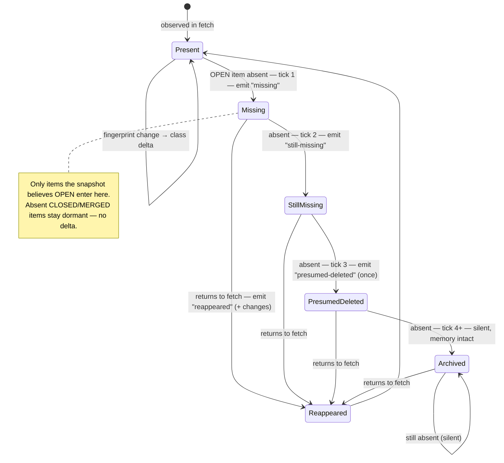

# Delta Classes

[Documentation](../README.md) · [Contract reference](../contract.md)

Closed set while `report.schemaVersion === 2`. Every delta carries at least one class; `classes`
is **never empty** (`updated` is the catch-all). `classes` is a **set** — several
can co-occur on one delta (e.g. `ci-changed` + `review-changed`). Order within
the array is not significant and not guaranteed stable.

| Class                         | Applies to | Meaning                                                                                                                                                                                                                                                                                                                                                                                                |
| ----------------------------- | ---------- | ------------------------------------------------------------------------------------------------------------------------------------------------------------------------------------------------------------------------------------------------------------------------------------------------------------------------------------------------------------------------------------------------------ |
| `new`                         | pr, issue  | New issue or PR after the baseline. `from` is `null`.                                                                                                                                                                                                                                                                                                                                                  |
| `first-seen`                  | pr, issue  | First time this watcher observed a non-open item. It may predate the baseline; `from` is `null`, but consumers should not treat it as newly created.                                                                                                                                                                                                                                                   |
| `baseline-state`              | pr, issue  | Emitted only under `--baseline-emit-state`, once per tracked OPEN item on the run that seeds a baseline. `from` is `null`, `to` is the freshly observed item. Surfaces state that already existed at baseline (e.g. an already-conflicting or already-CI-blocked PR). The content-addressed `id` is stable across re-baselining. Consumers must **not** treat it as newly created (like `first-seen`). |
| `closed`                      | pr, issue  | Issue or PR was closed.                                                                                                                                                                                                                                                                                                                                                                                |
| `reopened`                    | pr, issue  | Issue or PR was reopened (state returned to `open`).                                                                                                                                                                                                                                                                                                                                                   |
| `new-comments`                | pr, issue  | Conversation comment count increased.                                                                                                                                                                                                                                                                                                                                                                  |
| `comments-removed`            | pr, issue  | Conversation comment count decreased (comment deleted, or deletions outnumbering additions within one tick). Prior context an agent read may be gone; re-read before acting.                                                                                                                                                                                                                           |
| `relabeled`                   | pr, issue  | Labels changed. Detail names the added/removed labels.                                                                                                                                                                                                                                                                                                                                                 |
| `assignees-changed`           | pr, issue  | Assignees changed. Detail names the added/removed logins. Neutral state transition: gh-delta reports who owns the item now, never who _should_.                                                                                                                                                                                                                                                        |
| `updated`                     | pr, issue  | Fingerprint changed with no more specific class. Coexists with `head-changed` on a plain push (nothing else changed).                                                                                                                                                                                                                                                                                  |
| `missing`                     | pr, issue  | An item the snapshot believes OPEN vanished from the fetch. Check pagination, permissions, or scope before trusting it. Absent closed items are dormant memory, not a missing delta. `to` is `null`.                                                                                                                                                                                                   |
| `still-missing`               | pr, issue  | An already-missing open item is still absent (tick 2). Unresolved operational state, not a fresh delta. `to` is `null`.                                                                                                                                                                                                                                                                                |
| `presumed-deleted`            | pr, issue  | Absent for 3 consecutive ticks; treated as deleted, transferred, or converted. Emitted once; the object then goes silent but stays in memory (`missingTicks` counter in the stored fingerprint). `reappeared` still fires if the object returns. `to` is `null`.                                                                                                                                       |
| `reappeared`                  | pr, issue  | An object previously marked `missing` returned to the fetch. It may co-occur with other classes if the fingerprint also changed.                                                                                                                                                                                                                                                                       |
| `merged`                      | pr only    | PR was merged.                                                                                                                                                                                                                                                                                                                                                                                         |
| `draft-ready`                 | pr only    | PR moved from draft to ready for review.                                                                                                                                                                                                                                                                                                                                                               |
| `converted-to-draft`          | pr only    | PR moved back from ready to draft. The inverse of `draft-ready`.                                                                                                                                                                                                                                                                                                                                       |
| `ci-changed`                  | pr only    | The normalized checks array (`{name, kind, status, conclusion, detailsUrl, runId?, jobId?}` rows) changed.                                                                                                                                                                                                                                                                                             |
| `review-changed`              | pr only    | Review decision or the normalized latest-reviews array changed.                                                                                                                                                                                                                                                                                                                                        |
| `became-mergeable`            | pr only    | PR moved from `conflicting` to `mergeable` (an `unknown` mid-recompute placeholder does not count). Best-effort edge trigger: a transition sampled through the `unknown` window surfaces as `updated` instead — gate decisions on the observed `mergeable` state, not on this class.                                                                                                                   |
| `became-conflicting`          | pr only    | PR moved from `mergeable` to `conflicting` (an `unknown` mid-recompute placeholder does not count). The inverse of `became-mergeable`, with the same best-effort caveat: sampling through `unknown` yields `updated` instead.                                                                                                                                                                          |
| `unresolved-threads-added`    | pr only    | A review thread became unresolved: the unresolved count increased, OR a same-count identity diff found a thread newly unresolved (e.g. one thread resolved while another reopened in the same tick). When `--detail` is set, a `field: "threads"` row names the affected thread ids (`added`/`removed`) even when the count itself did not move.                                                       |
| `unresolved-threads-resolved` | pr only    | A review thread became resolved: the unresolved count decreased, OR a same-count identity diff found a thread newly resolved. Same `field: "threads"` detail row as `unresolved-threads-added`.                                                                                                                                                                                                        |
| `review-threads-changed`      | pr only    | PR review thread total changed while the unresolved count held steady.                                                                                                                                                                                                                                                                                                                                 |
| `review-requests-changed`     | pr only    | Requested reviewers changed (review requested or a request withdrawn/satisfied). Detail names the added/removed logins (teams as `org/slug`). Note GitHub removes a user from `reviewRequests` once they submit a review, so a submitted review usually fires this together with `review-changed`.                                                                                                     |
| `base-changed`                | pr only    | Base branch changed (PR retargeted). Prior CI and mergeability context refer to the old base; expect `mergeable: unknown` churn while GitHub recomputes.                                                                                                                                                                                                                                               |
| `review-comments-added`       | pr only    | A review thread's reply count increased (a new inline review reply, distinct from a top-level conversation comment). Fails open under `--ignore-authors` when reply authorship cannot be attributed; see the `--ignore-authors` bullet in [Agent output schemas](agent-output.md#agent-output-schemas).                                                                                                |
| `review-comments-removed`     | pr only    | A review thread's reply count decreased.                                                                                                                                                                                                                                                                                                                                                               |
| `head-changed`                | pr only    | PR head commit SHA changed (push, rebase, or force-push cannot be told apart from the SHA alone). Independent of `updated`: a head change with nothing else different fires `head-changed` alone, not `head-changed` + `updated`. Detail carries `from`/`to` SHAs.                                                                                                                                     |
| `stale`                       | pr, issue  | Emitted only with `--stale-after`, once per UTC day after an OPEN item's unchanged fingerprint reaches the threshold. `staleAt` is that UTC day and is included in the delta id; `--detail` exposes it.                                                                                                                                                                                                |

**Forward compatibility:** new classes may be added in a later minor version.
Consumers must treat an unrecognized class as "something changed, inspect,"
never as an error. See also [schemaVersion policy](schema-version.md#schemaversion-policy).

## Lifecycle of a missing item

When a previously-tracked open item vanishes from the fetch, it advances through this fixed lifecycle before going permanently silent.

