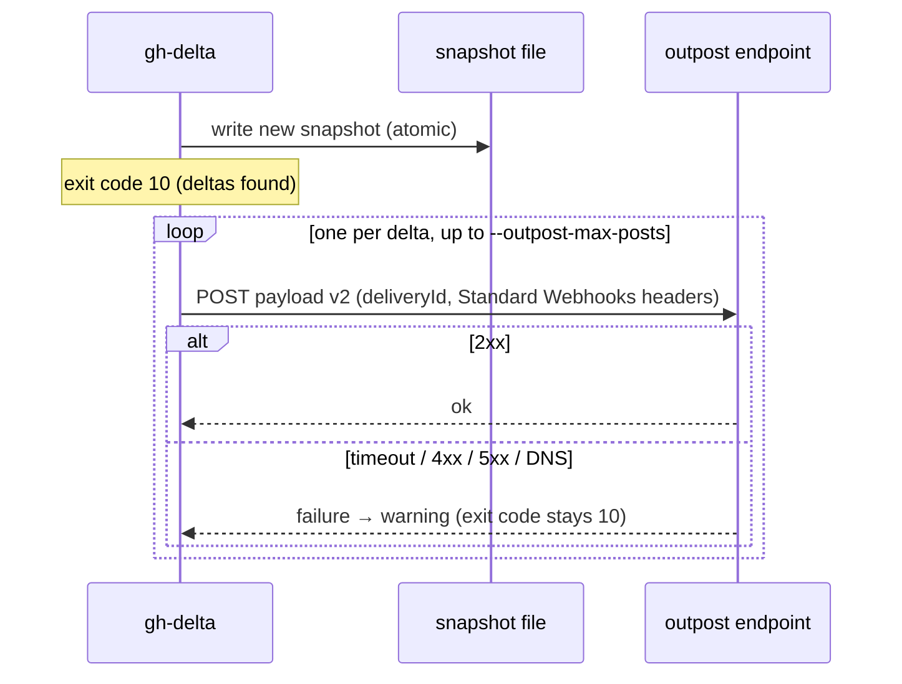

# Outpost Payload (schema v2)

[Documentation](../README.md) · [Contract reference](../contract.md)

One JSON `POST` per delta when the detector exits `10` and `--outpost-url` is set.
The payload is an envelope around the delta **verbatim from the report** — no
root-level field duplication of `context`/`classes`/`summary`/etc. `delta.from`
and `delta.to` follow the same rules as the report (see
[Report Shape](report.md#report-shape)): the bare compared fingerprint, or `null`.

The delivery sequence makes the at-most-once guarantee explicit: the snapshot is written before any POST, and a delivery failure leaves the exit code and report unchanged.

Signing uses [Standard Webhooks](https://www.standardwebhooks.com/), not a
custom header. When `--outpost-secret ENV_VARIABLE_NAME` is supplied, each POST
carries three headers: `webhook-id` (the payload's `deliveryId`),
`webhook-timestamp` (epoch **seconds**, not milliseconds), and
`webhook-signature` (`v1,<base64 HMAC-SHA256("{id}.{timestamp}.{body}")>`,
computed over the exact UTF-8 `JSON.stringify(payload)` bytes sent in that
request). The secret is never included in payloads, reports, warnings, logs,
help, or process arguments.



```json
{
  "type": "gh-delta.delta",
  "schemaVersion": 2,
  "deliveryId": "gh-delta.delivery.v1:owner/repo:prs-5m:pr:42:new:2026-07-01T12:00:00.000Z",
  "seq": 41,
  "monitorId": "prs-5m",
  "detectedAt": "2026-07-01T12:00:00.000Z",
  "delta": {
    "id": "6499ce3b352467f7bfabf0fa35571eed8ed4e24cc3373fb715ec245680904e0",
    "entity": "pr",
    "number": 42,
    "context": {
      "id": "PR_kwDOABCDEF",
      "title": "Add widget",
      "url": "https://github.com/owner/repo/pull/42",
      "author": "octocat",
      "createdAt": "2026-06-01T09:00:00Z",
      "headRefName": "add-widget"
    },
    "classes": ["new"],
    "changed": {},
    "summary": { "state": "open", "...": "..." },
    "from": null,
    "to": { "state": "open", "...": "..." }
  }
}
```

`seq` is the delta's durable-log journal record number when the run used
`--log`, or `null` (not omitted — a receiver storing this payload should not
have to distinguish "no log" from "field absent"). Outpost is best-effort
notification. The payload carries two distinct identifiers, each with its own
job — do not use one where the other belongs:

- **`delta.id`** is the identity of the **change**: the same content-addressed
  delta id carried in the JSON report, hashed from the observed `to` state (or
  `from`/`classes`/`missingTicks` for the missing lifecycle). It is stable
  across runs **and across monitors** (it excludes `monitorId`), and it is
  **the correct field to dedupe work by** — with a caveat, because `id`
  identifies the observed **state**, not "this specific occurrence": an item
  that returns to a previously observed state (e.g. CI red, then green, then
  red again with nothing else on the fingerprint changed) repeats its earlier
  `id` by design. Do **not** dedupe `id` against unbounded history — that
  discards the legitimate third delta as a false duplicate. Instead dedupe
  against the **most recent `id` per item** (or a bounded recent window):
  suppress a payload only when its `id` matches the last `id` recorded for
  that `(entity, number)`, which still collapses true duplicate deliveries
  (two monitors observing the same change emit the same `id` — it excludes
  `monitorId` — and arrive adjacently) while correctly forwarding a later
  recurrence of an earlier state. Also note that for deltas with an observed
  `to` state, `id` excludes `classes` as well as `monitorId` — two monitors
  with different snapshot histories can reach the same final state through
  different transitions and emit the **same `id` with different class sets**,
  so any receiver-side class filtering must run and be resolved **before**
  the `id` is recorded, not after. The reference implementation of this rule
  is `examples/outpost-ntfy-receiver/receiver.mjs`'s `shouldForward`: it
  tracks the last `delta.id` per `(repo, entity, number)` and only forwards a
  payload whose `id` differs from that recorded value. Optional `delta.watch.labels`
  is routing context copied from the watch entry; it is identical across JSON,
  compact, NDJSON, and log replay, and it never participates in `delta.id`.
- **`deliveryId`** is the identity of **one send attempt**: it is also used
  for **processing idempotency** — the Standard Webhooks `webhook-id` header
  a spec-conformant receiver can use to reject a byte-identical retry of the
  same send. Use it to correlate logs and transport retries, and to protect
  against duplicate HTTP delivery of the same attempt; never to dedupe
  **work** across distinct occurrences — it changes every tick even when
  nothing observable changed, so deduping work by it would silently drop
  every later, legitimate recurrence of an earlier state. `delta.id` is the
  one identifier for that.

`gh-delta` does not provide reliable
delivery, retries, an outbox, acknowledgement, or replay while
`report.schemaVersion === 2`. Classes are
sorted before they are joined into `deliveryId`, so its identity is independent
of the order the classifier emitted them. `context.headRefName` (the
PR head branch name, retained by GitHub after the branch is deleted) mirrors the
report delta exactly: present only in PR context that has a current object, and
absent from issue context.

The `summary` object is unconditional now (see
[Delta Summary schema](summary.md#delta-summary-schema)), so every PR payload with an
observed `to` state carries it — a webhook receiver reads the same semantic
state (`ciRollup`, `reviewDecision`, `mergeable`, …) as a consumer of the JSON
report, with no separate flag required.
